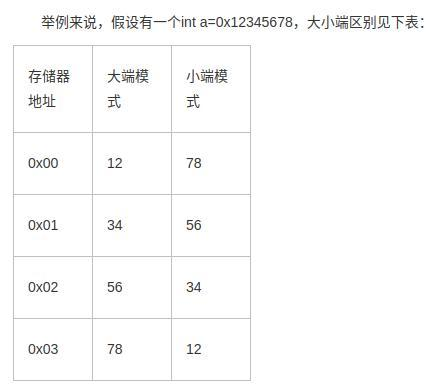

## 内存划分：  
- 栈：由编译器自动分配释放，存放程序临时创建的局部变量。此外，在函数被调用时，其参数也会被压入发起调用的进程栈中，并且待到调用结束后，函数的返回值也会被存放回栈中。用户栈总是从最大的合法用户地址开始，向下增长(低地址方向).
- 堆：由程序员分配释放，用于存放进程运行中被动态分配的内存段，它的大小并不固定，可动态扩张或缩减。当进程调用malloc等函数分配内存时，新分配的内存就被动态添加到堆上（堆被扩张）；当利用free等函数释放内存时，被释放的内存从堆中被剔除（堆被缩减）。
- 全局区（静态区）：全局变量和静态变量的存储是放在一块的，初始化的全局变量和静态变量在一块区域，未初始化的全局变量和未初始化的静态变量在相邻的另一块区域。
    - BSS段：BSS段（bss segment）通常是指用来存放程序中未初始化的全局变量的一块内存区域
    - 数据段：数据段（data segment）通常是指用来存放程序中已初始化的全局变量的一块内存区域。数据段属于静态内存分配。
- 常量区：放常量
    - 代码段：代码段（code segment/text segment）通常是指用来存放程序执行代码的一块内存区域。这部分区域的大小在程序运行前就已经确定，并且内存区域通常属于只读, 某些架构也允许代码段为可写，即允许修改程序。在代码段中，也有可能包含一些只读的常数变量，例如字符串常量等。代码段是存放了程序代码的数据，假如机器中有数个进程运行相同的一个程序，那么它们就可以使用同一个代码段。


## 进程栈一般多大，如何把进程栈撑爆炸
- 堆大小是可以自己申请的，只要不超过内存都是可以的。
- 栈大小系统会分配默认值，ulimit -s（后面接数字可重设）， 大小是 8192 kb，也就是 8 M
- 线程的最小栈大小为16KB， 即 PTHREAD_STACK_MIN 的大小 
- 撑爆（栈溢出）：在栈内写入超出长度限制的数据（递归）
    > 递归调用过程中当最初的结果依赖于后面的计算处理，
        后面的部分虽然后开始处理，却先结束。当后续处理太多并且又依赖更后面的处理......，
        便会一直压栈，当空间全部用完，就会造成栈溢出。


## linux内存中swap是什么? 什么用?
- swap space是磁盘上的一块区域
- 当系统物理内存吃紧时，Linux会将内存中不常访问的数据保存到swap上，这样系统就有更多的物理内存为各个进程服务，
    而当系统需要访问swap上存储的内容时，再将swap上的数据加载到内存中，这就是我们常说的swap out和swap in。   
- 大型应用程序在启动的过程中会使用大量的内存，但这些内存很多时候只是在启动的时候用一下，后面的运行过程中很少再用到。
    有了swap后，系统就可以将这部分不这么使用的内存数据保存到swap上去，从而释放出更多的物理内存供系统使用。
- ubuntu的休眠功能依赖于swap分区，当系统休眠的时候，会将内存中的数据保存到swap分区上，
    等下次系统启动的时候，再将数据加载到内存中，这样可以加快系统的启动速度
- 缺点：速度慢；不停读写 swap，影响系统性能。


 ## cpu内存、cpu缓存  cache的缓存如何和外存的缓存保持一致性
- 内存：CPU直接进行沟通的部件，所有的程序都是在内存中运行。其作用是暂时存放CPU的运算数据，以及与硬盘交换的数据。
- 缓存：CPU的存取速度很快，而内存的速度很慢，有些常用的数据或是地址，就直接存在缓存中。
        CPU每次会先到自己的缓存中寻找想要的东西，找不到的时候再去内存中获取。

## 缓存一致性
MESI 协议   
- MESI协议将cache line的状态分成修改、独占、共享和失效。
- 四种操作 ： local read、local write、remote read、remote write


## 用户态和内核态的区别? 为什么要有用户态内核态区别?
- 用户态：程序运行在3级特权级上；处于用户态执行时，进程所能访问的内存空间和对象受到限制，其所占有的处理机是可被抢占
- 内核态：程序运行在0级特权级上；而处于核心态执行中的进程，能访问所有的内存空间和对象，且所占用的处理机是不允许被抢占

- 用户态进入内核态
    - 外围设备的中断：外围设备完成用户请求的操作后，会向CPU发出相应的中断信号
    - 异常：如缺页异常
    - 系统调用：用户态进程主动要求切换到内核态，核心是使用了操作系统为用户特别开放的一个中断来实现，
                例如Linux的int 80h中断
- 在CPU的所有指令中，有些指令是非常危险的，如果错用，将导致系统崩溃，比如清内存、设置时钟等


## 中断有哪些类型, 区别?
- 强迫性中断
    - I/O 中断：外部设备或通道操作正常结束或发生某种错误时发生的中断（I/O传输出错、I/O传输结束）
    - 程序性中断：程序执行过程中，发现了程序性的错误或出现了某些程序的特定状态而产生的中断称为程序性中断。
        - 错误：定点溢出、十进制溢出、十进制数错、地址错、用户态下用核态指令、越界、非法操作
        - 特点状态：逐条指令跟踪、指令地址符合跟踪、转态跟踪、监视
    - 机器故障中断：当机器发生故障时所产生的中断（电源故障、通道与主存交换信息时主存储错、从主存取指令出错）
- 自愿中断
    - 访管中断：对操作系统提出某种需求（如请求I/O传输、建立进程等）时所发出的中断称为访管中断


## 调度算法
- 页面置换算法
    - OPT 最佳页面替换：淘汰不再访问的页或距现在最久访问的页面  
    - FIFO 先进先出页面替换：淘汰最先调入内存的页面
    - LRU 最近最少使用：淘汰最近一段时间内最久未被访问的页
    - SCR 第二次页面替换
    - Clock 时钟页面替换

- cpu（进程） 调度算法 
    - FCFS 先来先服务：先进入就绪队列的进程最先处理
    - SJF 最短作业优先：非剥夺式
        - 要求：进入就绪队列的进程预告需要多长CPU时间才能完成本次执行
        - 选取就绪队列中，“需要CPU时间”最短的进程。
    - 最短剩余时间优先：剥夺式
    - 优先级调度算法
        - 每个进程都有一个优先数（priority number），通常是个整型数。
        - 选取就绪队列（双向链表）中，优先权最高的进程。
    - RR（Round Robin） 轮转调度：剥夺式
        - 每个就绪进程获得一小段CPU时间
        - 时间片用毕，这个进程被迫交出CPU，重新挂回到就绪队列
    - CFS 完全公平调度：
        - 相关概念：
            - 每个进程都有一个nice值, 表示其静态优先级,nice值越小, 进程的权重越大
            - CFS调度器的一个调度周期值是固定的
            - 一个进程在一个调度周期中的运行时间为:
                - 分配给进程的运行时间 = 调度周期 * 进程权重 / 所有进程权重之和
                - 进程的权重越大, 分到的运行时间越多
            - 一个进程的实际运行时间和虚拟运行时间之间的关系：
                - vruntime = 实际运行时间 * NICE_0_LOAD / 进程权重
                - NICE_0_LOAD = 1024, 表示nice值为0的进程权重
                - 进程权重越大, 运行同样的实际时间, vruntime增长的越慢
            - 一个进程在一个调度周期内的虚拟运行时间大小为:
                - vruntime = 进程在一个调度周期内的实际运行时间 * 1024 / 进程权重
                - = (调度周期 * 进程权重 / 所有进程总权重) * 1024 / 进程权重 
                - = 调度周期 * 1024 / 所有进程总权重 
                - 一个进程在一个调度周期内的vruntime值大小和该进程自己的权重无关
                - 所以所有进程的vruntime值大小都是一样
        - 几个重要的结构
            - 完全公平运行队列（cfs_rq）
                - 描述运行在同一个cpu上的处于TASK_RUNNING状态的普通进程的各种运行信息
            - 调度实体（sched_entity）：记录一个进程的运行状态信息
        - CFS调度运行队列采用红黑树方式组织，红黑树中的key值以 vruntime 排序。
        - 每次选择下一个进程运行时即是选择最左边的一个进程运行。
        - 与 CFS 相关过程
            - 创建新进程: 创建新进程时, 需要设置新进程的vruntime值以及将新进程加入红黑树中. 并判断是否需要抢占当前进程
            - 进程唤醒: 唤醒进程时, 需要调整睡眠进程的vruntime值, 并且将睡眠进程加入红黑树中. 并判断是否需要抢占当前进程
            - 进程的调度: 进程调度时, 需要把当前进程加入红黑树中, 还要从红黑树中挑选出下一个要运行的进程.

- LVS调度算法（负载均衡）
    -  LVS（Linux Virtual Server）即Linux虚拟服务器。
    - 静态算法：只根据算法进行调度 而不考虑后端服务器的实际连接情况和负载情况
        - 轮询调度(RR)：将外部请求按顺序轮流分配到集群中的真实服务器上。
        - 加权轮询(WRR)：根据真实服务器的不同处理能力来调度访问请求。

    - 动态算法：前端的调度器会根据后端真实服务器的实际连接情况来分配请求
        - 最少链接(LC)：动态地将网络请求调度到已建立的链接数最少的服务器上。
        - 加权最少链接： 具有较高权值的服务器将承受较大比例的活动连接负载。
        - 基于局部性最少链接算法(LBLC)：请求分发时，前端负载均衡器根据请求目标 IP 
                查找该请求目标 IP 最近使用的服务器，如果该服务器没有超载则将请求分      
                发给该服务器；否则采用最小连接算法选择一台服务器分发请求        
        - 带复制的基于局部性最少连接算法(LBLCR):
            - 与 LBLC 相比，该算法维护一个从目标 IP 到服务器组的映射关系
            - 分发请求时，根据目标 IP 选择对应的服务器组，然后按照最小链接算法选择一台服务器进行请求分发
            - 如果选中的服务器已经超载，则使用最小链接算法从服务器组外选择一台服务器进行请求分发，
            - 同时将该服务器加入到目标 IP 对应的服务器组中
        - 源地址哈希法(SH)：算法先根据请求的源IP地址，作为散列键（Hash Key）从静态分配的散列表
                找出对应的服务器，若该服务器是可用的且并未超载，将请求发送到该服务器，否则返回空    
        - 目标地址哈希(DH)：同 SH，key 换成目的 IP


## 字节对齐（内存对齐）   
```C
typedef struct {
    int a;
    double b;
    short c;
}A;

typedef struct {
    int a;
    short b;
    double c;
}B;
// sizeof(A)=24, sizeof(B)=16
```   
1. 按照成员的声明顺序，依次安排内存，其偏移量为成员大小的整数倍，   
    0看做任何成员的整数倍，最后结构体的大小为最大成员的整数倍。        
2. Windows 默认对齐数为8字节，Linux 默认对齐数为4字节。       

自然对齐和规则对齐。
- 自然对齐： 
>指的是将对应变量类型存入对应地址值的内存空间，即数据要根据
    其数据类型存放到以其数据类型为倍数的地址处。例如char类
    型占1个字节空间，1的倍数是所有数，因此可以放置在任何允
    许地址处，而int类型占4个字节空间，以4为倍数的地址就有
    0,4,8等。编译器会优先按照自然对齐进行数据地址分配。   
- 规则对齐： 
>以结构体为例就是在自然对齐后，编译器将对自然对齐产生的空隙内存填充无效数据，
且填充后结构体占内存空间为结构体内占内存空间最大的数据类型成员变量的整数倍。     

为什么要内存对齐？          
1. 平台原因(移植原因)：不是所有的硬件平台都能访问任意地址上的任意数据的；某些硬件平台只能在某些地址处取某些特定类型的数据，否则抛出硬件异常。        
2. 性能原因：数据结构(尤其是栈)应该尽可能地在自然边界上对齐。原因在于，为了访问未对齐的内存，处理器需要作两次内存访问（数据先读高位，再读低位）；而对齐的内存访问仅需要一次访问。    


## 程序的地址保存的是虚拟地址还是物理地址
- 虚拟地址


24. 虚拟地址怎么映射到物理地址的


## 函数的参数除了存在栈里，还能存在哪里
- 寄存器


## 虚拟内存    
> 虚拟内存允许一个操作系统避开物理内存(4GB)的限制。虚拟内存为每个进程创建了一个 
    逻辑地址空间（也可以理解为虚拟地址空间），它将逻辑地址空间划分成同等大小的内存块，    
    被称为 pages 。处理器和它的内存管理单元(memory management unit (MMU))维持一个     
    page table 表(从程序的逻辑内存映射到电脑的RAM硬件内存)。       
- 将物理内存抽象为地址空间，每个进程都有各自的地址空间。地址空间的页被映射到物理内存，    
- 地址空间的页并不需要全部在物理内存中，当使用到一个没有在物理内存的页时，执行页面置换算法，将该页置换到内存中。


## 内存管理
- 分区： 内碎片：占用分区内未被利用的空间，外碎片：占用分区之间难以利用的空闲分区
    - 固定分区：内存划分为若干个固定大小的连续分区。
        - 优点：易于实现，开销小。
        - 缺点：内碎片造成浪费；分区总数固定，限制了并发执行的程序数目。
    - 动态分区：动态创建分区，在装入程序时按其初始要求分配，或在其执行过程中通过系统调用进行分配或改变分区大小。
        - 首次适应算法（First Fit）
        > 从空闲分区表的第一个表目起查找该表，把最先能够满足要求的空闲区分配给
            作业，这种方法的目的在于减少查找时间。为适应这种算法，空闲分区表（空闲区链）
            中的空闲分区要按地址由低到高进行排序。该算法优先使用低址部分空闲区，
            在低址空间造成许多小的空闲区，在高地址空间保留大的空闲区。
        - 下次适配法（Next Fit）
        > 按分区在内存的先后次序，从上次分配的分区起查找，找到符合要求的第一个分区进行分配。    
            该算法的分配和释放的时间性能较好，使空闲分区分布得更均匀，但较大空闲分区不易保留。  
        - 最佳适应算法（Best Fit)
        > 从全部空闲区中找出能满足作业要求的、且大小最小的空闲分区，这种方法能使
            碎片尽量小。为适应此算法，空闲分区表（空闲区链）中的空闲分区要按从小到大
            进行排序，自表头开始查找到第一个满足要求的自由分区分配。该算法保留大的空闲区，但造成许多小的空闲区。

        - 最差适应算法（Worst Fit)
        > 从全部空闲区中找出能满足作业要求的、且大小最大的空闲分区，从而使链表中的结点大小趋于均匀，
            适用于请求分配的内存大小范围较窄的系统。为适应此算法，空闲分区表（空闲区链）中的空闲分区按
            大小从大到小进行排序，自表头开始查找到第一个满足要求的自由分区分配。该算法保留小的空闲区，尽量
            减少小的碎片产生。
    - 伙伴系统：使用二进制优化的思想，将内存以2的幂为单位进行分配，合并时只能合并是伙伴的内存块。
        - 两个内存块是伙伴的三个条件是：
            - 大小相等
            - 地址连续
            - 两个内存块分裂自同一个父块(即合并后的首地址为父块大小的整数倍)
        - 出现原因
            - 固定分区方式限制了活动进程的数目，当进程大小与空闲分区大小不匹配时，内存空间利用率很低。
            - 动态分区方式算法复杂，回收空闲分区时需要进行分区合并等，系统开销较大。
            - 伙伴系统方式是对以上两种内存方式的一种折衷方案。
        - 数据结构
            - 空闲块按大小和起始地址组织成二维数组
            - 初始状态：只有一个大小为2^u的空闲块。
        - 分配过程：
            - 由大到小在空闲块数组中找最小的可用分区块。
            - 如空闲块过大，对可用分区块进行二等分，直到得到合适的可用分区块。
    -  内存紧缩：将各个占用分区向内存一端移动，然后将各个空闲分区合并成为一个空闲分区。
    - 覆盖技术：目标是在较小的可用内存中运行较大的程序
        - 原理：
            - 一个程序的几个代码段或数据段，按照时间先后来占用公共的内存空间。
            - 将程序必要部分(常用功能)的代码和数据常驻内存
            - 可选部分(不常用功能)平时存放在外存(覆盖文件)中，在需要时才装入内存。
            - 不存在调用关系的模块不必同时装入到内存，从而可以相互覆盖。
        - 缺点：
            - 编程时必须划分程序模块和确定程序模块之间的覆盖关系，增加编程复杂度
            - 从外存装入覆盖文件，以时间延长换取空间节省。
    - 交换技术：多个程序并发执行时，可以将暂时不能执行的程序（进程）送到外存中，    
                从而获得空闲内存空间来装入新程序（进程），或读入保存在外存中而处于就绪状态的程序。  
        - 原理：
            - 暂停执行内存中的进程，将整个进程的地址空间保存到外存的交换区中（swap out）
            - 将外存中由阻塞变为就绪的进程的地址空间读入到内存中，并将该进程送到就绪队列（swap in）
        - 优点：
            - 增加并发运行的程序数目，并给用户提供适当的响应时间
            - 盖技术相比交换技术不影响程序结构。
        - 缺点：对换入和换出的控制增加处理器开销
- 页式管理
    - 原理：
        - 将程序的逻辑地址空间划分为固定大小的页(page)，而物理内存划分为同样大小的页框(page frame)
        - 程序加载时，可将任意一页放人内存中任意一个页框，这些页框不必连续，从而实现了离散分配
    - 地址结构：前一部分是页号，后一部分为页内地址（位移量）
    - 优点：
        - 没有外碎片，每个内碎片不超过页大
        - 一个程序不必连续存放。
        - 便于改变程序占用空间的大小(主要指随着程序运行，动态生成的数据增多，所要求的地址空间相应增长)。
    - 缺点：要求程序全部装入内存，没有足够的内存，程序就不能执行。
    - 数据结构：
        > 在页式系统中进程建立时，操作系统为进程中所有的页分配页框。当进程撤销时收回所有分配给它的页框。
            在程序的运行期间，如果允许进程动态地申请空间，操作系统还要为进程申请的空间分配物理页框.
        - 进程页表（页号+块号）:完成逻辑页号(本进程的地址空间)到物理页面号(实际内存空间，也叫块号)的映射.
            - 每个进程有一个页表，描述该进程占用的物理页面及逻辑排列顺序
        - 物理页面表：整个系统有一个物理页面表，描述物理内存空间的分配使用状况，其数据结构可采用位示图和空闲页链表。
        - 请求表：整个系统有一个请求表，描述系统内各个进程页表的位置和大小
    - 地址变换
        - 在页式系统中，指令所给出的地址分为两部分：逻辑页号和页内地址。
        - CPU中的内存管理单元(MMU)按逻辑页号通过查进程页表得到物理页框号，将物理页框号与页内地址相加形成物理地址
        - 快表（TLB）：加快地址变换
            - 出现原因：
                - 存取一个数据或一条指令至少要访问两次内存
                - 一次是访问页表，确定所存取的数据或指令的物理地址
                - 第二次才根据该地址存取数据或指令
            - 地址变换过程
                - CPU给出逻辑地址后，由硬件进行地址转换并将页号送入高速
                    缓存寄存器，并将此页号与快表中的所有页号进行比较。
                - 如果找到匹配的页号，说明所要访问的页表项在快表中，则直接从中取出该页对
                    应的页框号，与页内偏移量拼接形成物理地址。这样，存取数据仅一次访存便可实现。
                - 如果没有找到，则需要访问主存中的页表，在读出页表项后，
                    应同时将其存入快表，以便后面可能的再次访问。
- 段式管理
    - 原理：
        - 将程序的地址空间划分为若干个段(segment)，这样每个进程有一个二维的地址空间
        - 为每个段分配一个连续的分区，而进程中的各个段可以不连续地存放在内存的不同分区中
        - 程序加载时，操作系统为所有段分配其所需内存，这些段不必连续
        - 物理内存的管理采用动态分区的管理方法
    - 数据结构：
        - 进程段表：描述组成进程地址空间的各段，可以是指向系统段表中表项的索引。
        - 系统段表：系统所有占用段（已经分配的段）
        - 空闲段表：内存中所有空闲段，可以结合到系统段表中。
- 段页式管理
    - 分页系统能有效地提高内存的利用率，而分段系统能反映程序的逻辑结构
    - 段页式管理系统中，用户程序的逻辑地址空间首先被划分成若干个逻辑分段，
        每段都有自己的段号，然后再将每段分成若干个大小相等的页。
- 分页分段区别
    - 分页是信息的物理单位；分段是信息的逻辑单位
    - 分页大小一样，由系统固定；分段大小不等，由用户确定
    - 分页地址空间是一维；分段地址空间是二维


17. 段页式的原理，段页式需要几次访存;分段和分页有什么区别？各自适合什么场景？


## mmap (内存映射函数)
> mmap是一种内存映射文件的方法，即将一个文件或者其它对象映射到进程的地址空间，  
实现文件磁盘地址和进程虚拟地址空间中一段虚拟地址的一一对映关系。实现这样的映射  
关系后，进程就可以采用指针的方式读写操作这一段内存，而系统会自动回写脏页面到对  
应的文件磁盘上，即完成了对文件的操作而不必再调用read,write等系统调用函数。相    
反，内核空间对这段区域的修改也直接反映用户空间，从而可以实现不同进程间的文件共享。  

- mmap内存映射的实现过程，总的来说可以分为三个阶段
    - 进程启动映射过程，并在虚拟地址空间中为映射创建虚拟映射区域
    - 调用内核空间的系统调用函数mmap（不同于用户空间函数），实现文件物理地址和进程虚拟地址的一一映射关系
    - 进程发起对这片映射空间的访问，引发缺页异常，实现文件内容到物理内存（主存）的拷贝
- 优点
    - 对文件的读取操作跨过了页缓存，减少了数据的拷贝次数，用内存读写取代I/O读写，提高了文件读取效率。
    - 实现了用户空间和内核空间的高效交互方式。两空间的各自修改操作可以直接反映在映射的区域内，从而被对方空间及时捕捉。
    - 提供进程间共享内存及相互通信的方式。不管是父子进程还是
        无亲缘关系的进程，都可以将自身用户空间映射到同一个文
        件或匿名映射到同一片区域。从而通过各自对映射区域的改动，
        达到进程间通信和进程间共享的目的。
     > 同时，如果进程A和进程B都映射了区域C，当A第一次读取C时通过缺页
     从磁盘复制文件页到内存中；但当B再读C的相同页面时，虽然也会产生缺页异常，   
     但是不再需要从磁盘中复制文件过来，而可直接使用已经保存在内存中的文件数据。 
 


## 内存中进程驻留集如何选定
- 驻留集：指请求分页存储管理中给进程分配的物理内存块的集合
- 分配方式
    - 固定分配：操作系统为每个进程分配一组固定数组的物理块，在进程运行期间不再改变。即驻留集大小不变。
    - 可变分配：先为每个进程分配一定数目的物理块，在进程运行期间，可根据情况做适当的增加或减少。即驻留集大小可变。
- 置换方式
    - 局部置换：发生缺页时只能选进程自己的物理块进行置换。
    - 全局置换：可以将操作系统保留的空闲物理块分配给缺页的进程，也可以将别的进程保持有的物理块置换到外存，再分配给缺页进程。
- 分配置换策略
    - 固定分配局部置换：系统为每个进程分配一定数量的物理块，在整个运行期间都不改变。    
        - 缺点：很难在刚开始就确定应该为每个进程分配多少个物理块才算合理。  
    - 可变分配全局置换：刚开始会为每个进程分配一定数量的物理块。操作系统会保持一个空闲物理块队列。  
                    当某个进程发生缺页时，从空闲的物理块中取出一块分配给该进程。    
                    只要某进程发生缺页，都将获得新的物理块，仅当空闲块用完时，系统才选择一个未锁定的页面调出。  
        - 缺点：被选择调出的页可能是系统中任何一个进程中的页，因此这个被选中的进程拥有的物理块会减少，缺页率会增加。    
    - 可变分配局部置换：刚开始会为每个进程分配一定数量的物理块。当某进程发生缺页时，    
                    只允许从该进程自己的物理块中选出一个进行换出外存。  

    - ps：
        - 可变分配全局置换：只要缺页就给分配新的物理块。
        - 可变分配局部置换：要根据缺页的频率来动态地增加或减少进程物理块。
- 何时调入页面
    - 预调页策略：根据局部性原理，一次调入若干个相邻的页面可能比一次调入一个页面更高效。
        - 缺点：成功率只有50左右
    - 请求调页策略：进程在运行期间缺页时才将所缺页面调入内存。
        - 缺点：每次调页都要磁盘I/O操作，因此I/O开销大。

## 内存泄漏
- 含义：由于疏忽或错误造成程序未能释放已经不再使用的内存的情况。


## 什么是内存栅栏
- 内存栅栏：是让一个CPU处理单元中的内存状态对其它处理单元可见的一项技术
- 功能：
    - 确保从另一个CPU来看栅栏的两边的所有指令都是正确的程序顺序
    - 实现内存数据可见性，确保内存数据会同步到CPU缓存子系统
- 为什么需要
> 对主存的一次访问一般花费硬件的数百次时钟周期。为了减少这种操作，
  CPU通过使用Cache来达到高效获取数据的目的。然后Cache为了提高性能，
  会对指令进行重排序。当重排序对最终的结果没有影响的时候，这种优化是有益的。
  但是当多线程共享数据时，重排序将导致错误的结果。所以为了在共享变量的情况下
  依然可以使用指令重排序，产生了内存栅栏来保证程序的正确性。


## 上下文切换的全过程
- Linux 为每个 CPU 都维护了一个就绪队列，将活跃进程(即正在运行和正在等待 CPU 的进程)
    按照优先级和等待 CPU 的时间排序，然后选择最需要 CPU 的进程。
- 进程切换发生场景
    - 为了保证所有进程可以得到公平调度，CPU 时间被划分为一段段的时间片，    
        这些时间片再被轮流分配给各个进程。这样，当某个进程的时间片耗尽了，  
        就会被系统挂起，切换到其它正在等待 CPU 的进程运行。 
    - 进程在系统资源不足(比如内存不足)时，要等到资源满足后才可以运行，  
        这个时候进程也会被挂起，并由系统调度其他进程运行。  
    - 当进程通过睡眠函数 sleep 这样的方法将自己主动挂起时，也会重新调度 
    - 当有优先级更高的进程运行时，为了保证高优先级进程的运行，  
        当前进程会被挂起，由高优先级进程来运行。    
    - 发生硬件中断时，CPU 上的进程会被中断挂起，转而执行内核中的中断服务程序。
- 进程上下文切换
    1. 保存处理机上下文，包括程序计数器和其他寄存器。
    2. 更新PCB（进程控制块）信息。
        - 进程标识符 name
        - 进程当前状态 status
        - 进程相应的程序和数据地址
        - 进程资源清单
        - 进程优先级 priority
        - CPU现场保护区 cpustatus
    3. 把进程的PCB移入相应的队列，如就绪、在某事件阻塞等队列。
    4. 选择另一个进程执行，并更新其PCB。
    5. 更新内存管理的数据结构。
    6. 恢复处理机上下文。
- 线程上下文切换
    - 同一进程下线程会共享相同的虚拟内存和全局变量等资源
    - 线程也有自己的私有数据，比如栈和寄存器等，这些在上下文切换时需要保存
    - 切换
        - 同一进程下的线程切换：虚拟内存是共享的，所以在切换时，虚拟内存这些资源就保持不动，
            只需要切换线程的私有数据、寄存器等不共享的数据。
        - 不同一进程下的线程切换： 和进程上下文切换一样。
- 中断上下文切换：
    - 为了快速响应硬件的事件，中断处理会打断进程的正常调度和执行，转而调用中断处理程序，响应设备事件。
    - 对同一个 CPU 来说，中断处理比进程拥有更高的优先级     
    - 跟进程上下文切换一样，中断上下文切换也需要消耗 CPU，  
        切换次数过多也会耗费大量的 CPU，甚至严重降低系统的整体性能。  


## 几种io方式
- IO 两个阶段
    - 等待数据准备
    - 将数据从内核拷贝到进程中
- 缓存 IO（标准IO）
    - 含义：数据会先被拷贝到操作系统内核的缓冲区中，然后才会从
           操作系统内核的缓冲区拷贝到应用程序的地址空间。   
    - 缺点：数据拷贝操作所带来的 CPU 以及内存开销非常大。  
- 同步模型：
    - 阻塞IO（blocking I/O）：
        - 含义：进程发起read后，如果内核未准备好数据，进程就会被block，进入等待阶段；
                等待内核将数据准备好，才会返回数据，解除阻塞
        - 优点：能够及时返回数据，无延迟；
        - 缺点：处于等待要付出性能的代价
    - 非阻塞IO（noblocking I/O）
        - 含义：进程发起read请求，内核未准备好数据，直接返回一个error，进程无需阻塞等待； 
                进程会轮询发送read请求，如此往复；  
                一直到内核准备好数据，才把数据拷贝并返回给进程，结束轮询  
        - 优点：能够在等待任务完成的时间里干其他活。
        - 缺点：任务完成的响应延迟增大，任务可能在两次轮询之间的任意时间完成。
    - 信号驱动IO（signal blocking I/O）
    - IO复用（I/O multiplexing）
        - 含义：一个进程能同时等待多个文件描述符，而这些文件描述符（套接字描述符）
                其中的任意一个进入读就绪状态，select()函数就可以返回。
        - 优点：同时处理多个连接请求。

        - select:
            - select()的机制中提供一种fd_set的数据结构，实际上是一个long类型的数组，
                每一个数组元素都能与一打开的文件句柄。 
            - fd_set可以理解为一个集合，这个集合中存放的是文件描述符
            - 每次调用select，都需要把fd_set集合从用户态拷贝到内核态
            - 每次调用select都需要在内核遍历传递进来的所有fd_set
            - 为了减少数据拷贝带来的性能损坏，内核对被监控的fd_set集合大小做了限制
            - 返回值：若有就绪描述符返回其数目，若超时则为0，若出错则为-1
            - select 的 timeout 参数精度为 1ns，而 poll 和 epoll 为 1ms， 
                select 适用于实时性要求比较高的场景
        - poll
            - poll改变了文件描述符集合的描述方式，使用了pollfd结构而不是select的fd_set结构
            - 管理多个描述符也是进行轮询
            - 使用链表保存文件描述符，因此没有了监视文件数量的限制
            - poll 没有最大描述符数量的限制，如果平台支持并且对实时性要求不高，
                应该使用 poll 而不是 select。
        - epoll
            - epoll没有描述符个数限制，使用一个文件描述符管理多个描述符
            - 红黑树
            - epoll_create 函数创建一个epoll句柄，参数size表明内核要监听的描述符数量。
                - 执行epoll_create时，创建了红黑树和就绪list链表。
            - epoll_ctl 函数注册要监听的事件类型
                - 执行epoll_ctl时，如果增加fd（socket），则检查在红黑树中是否存在，存在立即返回，
                    不存在则添加到红黑树上，然后向内核注册回调函数，用于当中断事件来临时
                    向准备就绪list链表中插入数据。  
            - epoll_wait 函数等待事件的就绪，成功时返回就绪的事件数目，
                        调用失败时返回 -1，等待超时返回 0。
                - 执行epoll_wait时立刻返回准备就绪链表里的数据即可。
            - 水平触发（LT）：默认工作模式，即当epoll_wait检测到某描述符事件就绪并通知应用程序时，
                            应用程序可以不立即处理该事件；下次调用epoll_wait时，会再次通知此事件。
            - 边缘触发（ET）： 当epoll_wait检测到某描述符事件就绪并通知应用程序时，
                            应用程序必须立即处理该事件。如果不处理，下次调用epoll_wait时，
                            不会再次通知此事件。    
            - 应用：只需要运行在 Linux 平台上，有大量的描述符需要同时轮询。

        > （1）select，poll实现需要自己不断轮询所有fd集合，直到设备就绪，期间可能要睡眠和唤醒多次交替。 
            而epoll其实也需要调用epoll_wait不断轮询就绪链表，期间也可能多次睡眠和唤醒交替，但是它是设备就绪 
            时，调用回调函数，把就绪fd放入就绪链表中，并唤醒在epoll_wait中进入睡眠的进程。虽然都要睡眠和交替，  
            但是select和poll在“醒着”的时候要遍历整个fd集合，而epoll在“醒着”的时候只要判断一下就绪链表是否为 
            空就行了，这节省了大量的CPU时间。这就是回调机制带来的性能提升。 

        > （2）select，poll每次调用都要把fd集合从用户态往内核态拷贝一次，并且要把current往设备等待队列中挂一次，
            而epoll在注册时候已经把fd拷贝到内核空间中，epollwait只要一次拷贝，而且把current往等待队列上挂也只挂
            一次（在epoll_wait的开始，注意这里的等待队列并不是设备等待队列，只是一个epoll内部定义的等待队列）。
            这也能节省不少的开销。  

- 异步模型：
    - 异步IO（asynchronous I/O）
        - 含义：用户进程进行aio_read系统调用之后，无论内核数据是否准备好，  
                都会直接返回给用户进程，然后用户态进程可以去做别的事情。    
                等到socket数据准备好了，内核直接复制数据给进程，然后从内核向进程发送通知。  


## 阻塞IO和非阻塞IO，你怎么理解？哪个性能更好？或者说你觉得它们各自有什么特点？
- 阻塞IO：在读写数据过程中会发生阻塞现象（调用结果返回之前，当前线程会被挂起）
- 非阻塞IO：用户线程需要不断地询问内核数据是否就绪

- 非阻塞IO解决了服务端有很多不活跃连接
- 当连接不多时，并且每个连接都很活跃时，阻塞IO性能可能比非阻塞要好


## 12345678用大小端改写    
 
- 判断大小端：
    - 联合体是共享内存，在联合体重定义一个char类型，一个int类型，
    - 给int数据赋值为1，根据char的值是否为1就可以判断大小端了;
    - 若char类型为1，则为小端；
    - 若char类型不为1，则为大端；


## 32位和64位操作系统编程的区别
- 32位的操作系统，最多支持4G的内存, 内存最小单位是字节, 2^32 bytes = 4G
- 32位的操作系统，支持基于32位的软件，不能运行64位的软件；而64位的系统一般这两种类型的都支持
- 64位处理器一次可提取64位数据,性能更高。

