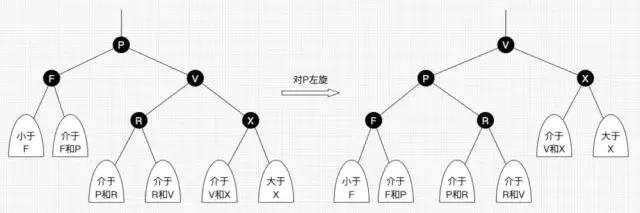

B(B-)树：   
1.根结点至少有两个子女。    
2.每个中间节点都包含k-1个元素和k个孩子，其中 ceil（m/2） ≤ k ≤ m    
3.每一个叶子节点都包含k-1个元素，其中 ceil（m/2） ≤ k ≤ m   
4.所有的叶子结点都位于同一层。  
5.每个节点中的元素从小到大排列，节点当中k-1个元素正好是k个孩子包含的元素的值域划分  
6.每个结点的结构为：（n，A0，K1，A1，K2，A2，…  ，Kn，An）  
    其中，Ki(1≤i≤n)为关键字，且Ki<Ki+1(1≤i≤n-1)。   
Ai(0≤i≤n)为指向子树根结点的指针。且Ai所指子树所有结点中的关键字均小于Ki+1。 
n为结点中关键字的个数，满足ceil(m/2)-1≤n≤m-1。

ps:ceil（3/2）=2, m(阶)：最大子节点数   

B+树：  
1.有k个子树的中间节点包含有k个元素（B树中是k-1个元素），每个元素不保存数据，只用来索引，所有数据    
都保存在叶子节点。  

2.所有的叶子结点中包含了全部元素的信息，及指向含这些元素记录的指针，且叶子结点本身依关键字的大小      
自小而大顺序链接。  

3.所有的中间节点元素都同时存在于子节点，在子节点元素中是最大（或最小）元素。    

**二叉树** 

满二叉树的高度： log2（n+1）    
*非递归实现遍历*
- 先序
```Python
#  先压入右孩子，再左孩子
def preOrderTravese(node):
    stack = [node]
    while len(stack) > 0:
        node = stack.pop()
        print(node.val)
        if node.right is not None:
            stack.append(node.right)
        if node.left is not None:
            stack.append(node.left)
```

- 中序
```Python
# 从根节点开始，左节点不断入栈，左节点为空时出栈一个节点，
# 出栈节点的右节点的左节点不断入栈
def inOrderTraverse(node):
    stack = []
    pos = node
    while pos is not None or len(stack) > 0:
        if pos is not None:
            stack.append(pos)
            pos = pos.left
        else:
            pos = stack.pop()
            print(pos.val)
            pos = pos.right
```
- 后序
```Python
# 后序打印二叉树（非递归）
# 使用两个栈结构
# 第一个栈进栈顺序：左节点->右节点->根节点(最开始没有左右节点，根节点先入栈)
# 第一个栈弹出顺序： 根节点->右节点->左节点(先序遍历栈弹出顺序：根->左->右)
# 第二个栈存储为第一个栈的每个弹出依次进栈
# 最后第二个栈依次出栈
def postOrderTraverse(node):
    stack = [node]
    stack2 = []
    while len(stack) > 0:
        node = stack.pop()
        stack2.append(node)
        if node.left is not None:
            stack.append(node.left)
        if node.right is not None:
            stack.append(node.right)
    while len(stack2) > 0:
        print(stack2.pop().val)

```


层序（广度优先遍历）
```Python
# -*- coding:utf-8 -*-
# class TreeNode:
#     def __init__(self, x):
#         self.val = x
#         self.left = None
#         self.right = None
class Solution:
    # 返回从上到下每个节点值列表，例：[1,2,3]
    def PrintFromTopToBottom(self, root):
        # write code here
        if not root:
            return []
        nodes = []
        bfs_nodes = []
        nodes.append(root)
        while nodes:
            node = nodes.pop(0)
            bfs_nodes.append(node.val)
            if node.left:
                nodes.append(node.left)
            if node.right:
                nodes.append(node.right)
        return bfs_nodes
```


**二分搜索树（BST）**
- 要求：数据必须有可比较性
- 每个节点的值都大于左子树所有节点的值
- 每个节点的值都小于于右子树所有节点的值
- 赠、查、删 时间复杂度是 O（log n）
ps: 可设置等于，即可以包含重复元素

```Python
# 递归实现BST
class Node:
    def __init__(self, val):
        self.val = val
        self.left = None
        self.right = None


# BST 插入的节点一定是叶子节点
def insert(root, val):
    if root is None:
        return Node(val)
    elif val < root.val:
        root.left = insert(root.left, val)
    elif val > root.val:
        root.right = insert(root.right, val)
    return root


def search(root, val):
    if root is None:
        return False

    elif val == root.val:
        return True
    elif val < root.val:
        return search(root.left, val)
    else:
        return search(root.right, val)


def find_min(root):
    if root.left is None:
        return root.val
    return find_min(root.left)


# 返回删除节点后的根节点
def delete_min(root):
    #  删除左节点（或根节点）后， 被删除节点的右节点不能丢
    if root.left is None:
        root_right = root.right
        # 回收内存
        root.right = None
        return root_right

    # 接住被删除节点的右节点
    root.left = delete_min(root.left)
    return root


# 前序遍历
# ps: 中序遍历是BST的递增排列
def pre_order(root):
    if root is None:
        return
    print(root.val)
    pre_order(root.left)
    pre_order(root.right)


def remove(root, val):
    if root is None:
        return
    if root.val < val:
        root.right = remove(root.right, val)
    elif root.val > val:
        root.left = remove(root.left, val)
    else:
        if root.left and root.right:
            # 同时存在左子树和右子树
            # 找到待删除节点的右子树的最小节点，
            successor = find_min(root.right)
            temp = delete_min(root.right)
            root.val = successor
            # 不可以省略，否则 root.right 没有左右子树的情况下会出错
            root.right = temp
        elif root.left:
            # 右子树为空
            root = root.left
        elif root.right:
            # 左子树为空
            root = root.right
        else:
            # 只有根节点
            root = None
    return root


if __name__ == '__main__':
    # test = [9, 6, 10, 3, 8]
    test = [11, 8, 19, 15, 25, 20, 27]
    root = None
    for num in test:
        root = insert(root, num)
    pre_order(root)
    # root = remove(root, 6)
    root = remove(root, 19)
    print('---------')
    pre_order(root)pych
    
```

**平衡二叉树（AVL树）**
- AVL树，是一种平衡(balanced)的二叉搜索树
- 任意一个结点的key，比它的左孩子key大，比它的右孩子key小
- 对于任意一个节点，左子树和右子树高度差不大于 1 
- AVL 是对 BST 的改进，防止二叉树出现链表的情况
- 最差情况下也是 O(log(n))

- 右旋
    - 旋转节点的左孩子变成根节点，此根节点的右孩子为旋转节点
    - 此根节点原本的右孩子变成旋转节点的左孩子

- 左旋
    - 旋转节点的右孩子变成根节点，此根节点的左孩子为旋转节点
    - 此根节点原本的左孩子变成旋转节点的右孩子

- 四种不平衡情况
    - LL： 左子树大于右子树 and 不平衡节点的左孩子的平衡度 >= 0, 右旋
    - RR： 右子树大于左子树 and 不平衡节点的右孩子的平衡度 <= 0，左旋
    - LR： 左子树大于右子树 and 不平衡节点的左孩子的平衡度 < 0，先左旋（不平衡节点的左孩子）变成LL， 后右旋（不平衡节点）
    - RL： 右子树大于左子树 and 不平衡节点的右孩子的平衡度 > 0， 先右旋（不平衡节点的右孩子）变成RR， 后左旋（不平衡节点）


**二叉堆**
- 实现： 完全二叉树
- 最大堆
    - 堆中某个节点的值总是不大于其父节点的值
    - 第二层节点的值不一定大于第三层节点的值
```Python
class Heap:
    def __init__(self):
        self.nodes = []
        self.size = 0

    def left_child(self, index):
        return 2 * index + 1

    def right_child(self, index):
        return 2 * index + 2

    def parent(self, index):
        if index == 0:
            raise ValueError("index-0 doesn't have parent")
        return (index - 1) // 2

    def is_empty(self):
        return self.size == 0

    def add(self, val):
        self.nodes.append(val)
        self.size += 1
        self.sift_up(self.size - 1)

    def sift_up(self, k):
        while k > 0 and self.nodes[self.parent(k)] < self.nodes[k]:
            self.nodes[k], self.nodes[self.parent(k)] = self.nodes[self.parent(k)], self.nodes[k]
            k = self.parent(k)

    def find_max(self):
        if self.size == 0:
            raise ValueError('heap is emoty')
        return self.nodes[0]

    def extract_max(self):
        node = self.find_max()
        self.size -= 1
        if self.size >= 1:
            self.nodes[0] = self.nodes[-1]
            self.nodes = self.nodes[:-1]
            self.sift_down(0)
        else:
            self.nodes[:] = []
        return node

    # 左右孩子， 如果是左（右）孩子与父节点交换了， 那么只需要再调整左（右）孩子即可
    def sift_down(self, k):
        while self.left_child(k) < self.size:
            j = self.left_child(k)
            # 存在右节点
            if j + 1 < self.size and self.nodes[j + 1] > self.nodes[j]:
                j = self.right_child(k)
            if self.nodes[k] >= self.nodes[j]:
                break
            self.nodes[k], self.nodes[j] = self.nodes[j], self.nodes[k]
            k = j

    # 建堆时间复杂度是 O(n)
    def heapify(self, nums):
        self.nodes.extend(nums)
        self.size = len(nums)
        last_parent = self.parent(self.size-1)
        parent_index = last_parent
        while parent_index >= 0:
            self.sift_down(parent_index)
            parent_index -= 1


if __name__ == '__main__':
    test = [5, 3, 7, 1, 9]
    print(test)
    print('------heap_a------')
    heap_a = Heap()
    for num in test:
        heap_a.add(num)
        print(heap_a.nodes)
    print('-------------- ')
    while heap_a.size > 0:
        print(heap_a.extract_max())

    print('------heap_b------')
    heap_b = Heap()
    heap_b.heapify(test)
    while heap_b.size > 0:
        print(heap_b.extract_max())
```


**优先队列**
- 即出队顺序与入队无关，优先级高（数值大）的先出
- 可用堆实现
- 应用：
    - q：在1000000元素中选出前100个（在N个元素中选出前M个）
    - 使用优先队列（最小堆）
    - 思路：维护一个 size为 100 的最小堆


**线段树**
- 实质：基于区间的统计查询
- 是  AVL 树， 不一定是完全二叉树
- 有 n 个元素， 开 4n 大小的空间一定可以存下所有元素
- 高级：懒惰更新、二维线段树
```Python
class SegmentTree:
    """线段树类"""

    def __init__(self, alist, merger_):
        """
        Description: 线段树的构造函数
        Params:
        - alist: 用户传入的一个list（这里我们就不用以前实现的Arr类了，直接用python的list啦，如果想用的话也是一点问题都没有的～）
        - func: merge函数，用于对实现两个数合成一个数的功能（比如二元操作符加法、乘法……等等）
        """
        self._data = alist[:]  # 所以为了不改变传入的数组，需要传其副本
        self._tree = [None] * 4 * len(self._data)  # 注意是4倍的存储空间，初始化元素全是None
        # self._tree = [None for i in range(len(self._data) * 4)]
        self._merger = merger_  # merger函数，比如两个元素求和函数……，用lambda表达式比较方便

        self._buildSegmentTree(0, 0, len(self._data) - 1)  # 调用self._buildSegmentTree来构建线段树

    def getSize(self):
        """
        Description: 获取有效元素的个数
        Returns:
        有效元素个数
        """
        return len(self._data)

    def get(self, index):
        """
        Description: 根据索引index获取相应元素
        时间复杂度：O(1)
        Params:
        - index: 传入的索引
        Returns:
        index索引处的元素值
        """
        if index < 0 or index >= len(self._data):
            raise Exception('Index is illegal!')
        return self._data[index]

    def query(self, quaryL, quaryR):
        """
        Description: 查找[quaryL, quaryR]这个左闭右闭区间上的值（例如对于求和操作就是求这个区间上所有元素的和）
        时间复杂度：O(logn)
        Params:
        - quaryL: 区间左端点的索引
        - quaryR: 区间右端点的索引
        Returns:
        [quaryL, quaryR]区间上的值
        """
        if quaryL < 0 or quaryR < 0 or quaryL >= self.getSize() or quaryR >= self.getSize() or quaryR < quaryL:  # 索引合法性检查
            raise Exception('The indexes is illegal!')
        return self._query(0, 0, self.getSize() - 1, quaryL, quaryR)  # 调用self._quary函数

    def set(self, index, e):
        """
        Description: 将数组中index位置的元素设为e，因此此时需要对线段树的内容要进行更新操作(也就是线段树的更新操作)
        时间复杂度：O(logn)
        Params:
        - index: 数组中的索引
        - e: 索引index上元素的新值e
        """
        if index < 0 or index >= self.getSize():
            raise Exception('The index is illegal!')
        self._data[index] = e  # 更新self._data
        self._set(0, 0, len(self._data) - 1, index, e)  # 调用self._set函数

    def printSegmentTree(self):
        """对线段树进行打印"""
        print('[', end=' ')
        for i in range(len(self._tree)):
            if i == len(self._tree) - 1:
                print(self._tree[i], end=' ]')
                break
            print(self._tree[i], end=',')

    # private
    def _leftChild(self, index):
        """
        Description: 和最大堆一样，由于线段树是一颗完全二叉树，所以可以通过索引的方式找到其左、右孩子的索引（元素从索引0开始盛放）
        Params:
        - index: 输入的索引
        Returns:
        左孩子的索引值
        """
        return 2 * index + 1  # 一定要记住线段树是一棵满树哦，所以用数组就能表示这棵树了，索引关系也和堆是一样的，只不过不需要求父亲节点的索引了

    def _rightChild(self, index):
        """
        Description: 和最大堆一样，由于线段树是一颗完全二叉树，所以可以通过索引的方式找到其左、右孩子的索引（元素从索引0开始盛放）
        Params:
        - index: 输入的索引
        Returns:
        右孩子的索引值
        """
        return 2 * index + 2

    def _buildSegmentTree(self, treeIndex, left, right):
        """
        Description: 以根节点索引为treeIndex，构造self._data索引在[left, right]上的线段树
        Params:
        - treeIndex: 线段树根节点的索引
        - left: 数据左边的索引
        - right: 数据右边的索引
        """
        if left == right:  # 递归到底的情况，left == right，此时只有一个元素
            self._tree[treeIndex] = self._data[left]  # 相应的，self._tree上索引为treeIndex的位置的值置为self._data[left]就好
            return

        leftChild_index = self._leftChild(treeIndex)  # 获取左孩子的索引
        rightChild_index = self._rightChild(treeIndex)  # 获取右孩子的索引

        mid = left + (right - left) // 2  # 获取left和right的中间值，在python中，可以用(left + right) // 2的方式来获得mid，因为不存在数值越界问题
        self._buildSegmentTree(leftChild_index, left, mid)  # 递归向左孩子为根的左子树构建线段树
        self._buildSegmentTree(rightChild_index, mid + 1, right)  # 递归向右孩子为的右子树构建线段树
        self._tree[treeIndex] = self._merger(self._tree[leftChild_index], self._tree[
            rightChild_index])  # 在回归的过程中，用self._merger函数对两个子节点的值进行merger操作，从而完成整棵树的建立

    def _query(self, treeIndex, left, right, quaryL, quaryR):
        """
        Description: 在根节点索引为treeindex的线段树上查找索引范围为[quaryL, quaryR]上的值，其中left， right值代表该节点所表示的索引范围（左闭右闭）
        Params:
        - treeIndex: 根节点所在的索引
        - left: 根节点所代表的区间的左端的索引值(注意是左闭右闭区间哦)
        - right: 根节点所代表的区间的右端点的索引值
        - quaryL: 待查询区间的左端的索引值（也是左闭右闭区间）
        - quaryR: 待查询区间的右端的索引值
        """
        if left == quaryL and right == quaryR:  # 递归到底的情况，区间都对上了，直接返回当前treeIndex索引处的值就好
            return self._tree[treeIndex]  # 返回当前树上索引为treeIndex的元素值

        mid = left + (right - left) // 2  # 获取TreeIndex索引处所代表的范围的中点
        leftChild_index = self._leftChild(treeIndex)  # 获取左孩子的索引
        rightChild_index = self._rightChild(treeIndex)  # 获取右孩子的索引

        if quaryL > mid:  # 此时要查询的区间完全位于当前treeIndex所带表的区间的右侧
            return self._query(rightChild_index, mid + 1, right, quaryL, quaryR)  # 直接去右子树找[quaryL, quaryR]
        elif quaryR <= mid:  # 此时要查询的区间完全位于当前treIndex所代表的区间的左侧
            return self._query(leftChild_index, left, mid, quaryL, quaryR)  # 直接去左子树找[quaryL, quaryR]

        # 此时一部分在[left, mid]上，一部分在[mid + 1, right]上
        leftResult = self._query(leftChild_index, left, mid, quaryL, mid)  # 在左子树找区间[quaryL, mid]
        rightResult = self._query(rightChild_index, mid + 1, right, mid + 1, quaryR)  # 在右子树找区间[mid + 1, quaryR]
        return self._merger(leftResult, rightResult)  # 最后在回归的过程中两个子节点进行merger操作并返回,得到[quaryL, quaryR]区间上的值

    def _set(self, treeIndex, left, right, index, e):
        """
        Description: 在以索引treeIndex为根节点的线段树中将索引为index的位置的元素设为e（此时treeIndex索引处所代表的区间范围为：[left, right]
        params:
        - treeIndex: 传入的线段树的根节点索引值
        - left: 根节点所代表的区间的左端的索引值
        - right: 根节点所代表的区间的右端点的索引值
        - index: 输入的索引值
        - e: 新的元素值
        """
        if left == right:  # 递归到底的情况，也就是在树中找到了索引为index的元素
            self._tree[treeIndex] = e  # 直接替换
            return

        mid = left + (right - left) // 2  # 找到索引中间值
        leftChild_index = self._leftChild(treeIndex)  # 左孩子索引值
        rightChild_index = self._rightChild(treeIndex)  # 右孩子索引值

        if index <= mid:  # index处于当前treeIndex所代表的区间的左半区
            self._set(leftChild_index, left, mid, index, e)  # 到左子树去找index
        else:  # 否则index处于当前treeIndex所代表的区间的右半区
            self._set(rightChild_index, mid + 1, right, index, e)  # 到右子树去找index
        self._tree[treeIndex] = self._merger(self._tree[leftChild_index], self._tree[
            rightChild_index])  # 由于对树的最底层元素进行了更新操作，因此需要对树的上层也进行一次更新，所以每次回归的都调用merger操作进行上层的值的更新操作


if __name__ == '__main__':
    input_list = [-2, 0, 3, -5, 2, -1]
    test_st = SegmentTree(input_list, merger_=lambda x, y: x + y)  # 这里以求和为例
    test_st.printSegmentTree()
    print()
    print('索引区间[0, 4]上的元素的和为：', test_st.query(0, 4))
    print('将索引为0的元素置为10：')
    test_st.set(0, 10)
    print('此时索引区间[0, 4]上的元素的和为：', test_st.query(0, 4))
```

**（trie树）字典树**
- 多叉树
- 查询每个条目的时间复杂度与一共有多少条目无关， 与条目（字符串）的长度有关
- 高阶：压缩字典树、三分搜索树

```Python
class Node:
    def __init__(self, is_world=False):
        self.is_world = False
        self.next = dict()


class Trie:
    def __init__(self):
        self._root = Node()
        self._size = 0

    def is_empty(self):
        return self._size == 0

    def get_size(self):
        return self._size

    def is_contain(self, word):
        cur = self._root
        for character in word:
            # 返回的 cur 是下一个字符所在的空间
            cur = cur.next.get(character, None)
            if cur is None:
                return False
        # cur 是最后一个字符所在空间
        return cur.is_world

    def is_contain_re(self, node, word, index):
        """
        递归版本
        :param node:
        :param word:
        :param index:开始调用时为 0
        :return:
        """
        if len(word) == index:
            return node.is_world
        dst_element = word[index]
        next_node = node.next.get(dst_element, None)
        if next_node is None:
            return False
        return self.is_contain_re(next_node, word, index + 1)

    def add(self, word):
        """
        添加单词
        :param word:
        :return:
        """
        if self.is_contain(word):
            return
        cur = self._root
        for character in word:
            cur = cur.next.setdefault(character, Node())
        cur.is_world = True
        self._size += 1

    def add_re(self, node, word, index):
        """
        添加单词， 递归
        :param node:
        :param word:
        :param index: 开始调用时为0
        :return:
        """
        if index == len(word):
            # 如果已经有这个单词， 就不需要添加
            if not node.is_world:
                node.is_world = True
                self._size += 1
            return
        dst_element = word[index]
        next_node = node.next.setdefault(dst_element, node())
        return self.add_re(next_node, word, index + 1)

    def is_prefix(self, astring):
        """
        查询 Trie 中是否有单词以 astring 为前缀
        :param astring:
        :return:
        """
        cur = self._root
        for character in astring:
            cur = cur.next.get(character, None)
            if cur is None:
                return False
        return True

    def remove(self, word):
        """
        删除单词
        :param word:
        :return:
        """
        cur = self._root
        record = [cur]
        for character in word:
            cur = cur.next.get(character, None)
            # 找不到字符串
            if cur is None:
                return
            record.append(cur)

        # 判断最后一个节点是不是叶子节点
        if len(cur.next):
            cur.is_world = False
            self._size -= 1
            return

        # 删除一个节点需要从它上一个节点入手
        string_index = len(word) - 1
        for record_index in range(len(record)-2, -1, -1):
            remove_char = word[string_index]    
            cur_node = record[record_index]
            del cur_node.next[remove_char]
            string_index -= 1
        self._size -= 1

```

**并查集**
- 应用：网络间节点的连接问题 
- 子节点指向父节点
- 数组中 index 所对于的 value 是父节点的 index， root 节点指向自己（即 nums[x] = x）

```Python
class UnionFind1:
    # 也称 quick find
    def __init__(self, length):
        self.id = [i for i in range(length)]
        self.length = length

    def get_size(self):
        return self.length

    def find(self, p):
        """
        时间复杂度 O（1）
        初始状态， 索引与值相等???
        查找元素 p 对应的集合编号
        :param p: 索引 p
        :return:
        """
        assert 0 <= p < self.length, 'p is out of range'
        return self.id[p]

    def is_connected(self, p, q):
        """
        时间复杂度 O（1）
        :param p:
        :param q:
        :return:
        """
        return self.find(p) == self.find(q)

    def union_elements(self, p, q):
        """
        并
        时间复杂度 O(n)
        :param p:
        :param q:
        :return:
        """
        # p 的老大
        pid = self.find(p)
        # q 的老大
        qid = self.find(q)

        # p q 属于同一集合
        if pid == qid:
            return
        # 将 pid 中的元素全部指向 qid
        for i in range(self.length):
            if self.id[i] == pid:
                self.id[i] = qid

    def print_union(self):
        for i, root in enumerate(self.id):
            if i != self.length - 1:
                print('{}->{}'.format(i, root), end=',', flush=True)
            else:
                print('{}->{}'.format(i, root))


class UnionFind2:
    # 树， 一个集合的根节点指向另一个集合的根节点
    def __init__(self, length):
        self.parent = [i for i in range(length)]
        self.length = length

    def get_size(self):
        return self.length

    def find(self, p):
        """
        时间复杂度 O（h）, h 是树高
        初始状态， 索引与值相等???
        查找元素 p 对应的集合编号
        :param p: 索引 p
        :return:
        """
        assert 0 <= p < self.length, 'p is out of range'
        while self.parent[p] != p:
            p = self.parent[p]
        return p

    def is_connected(self, p, q):
        """
        时间复杂度 O（h）, h 是树高
        :param p:
        :param q:
        :return:
        """
        proot = self.find(p)
        qroot = self.find(q)
        return proot == qroot

    def union_elements(self, p, q):
        """
        并
        时间复杂度 O(h), h 是树高
        :param p:
        :param q:
        :return:
        """
        # p 的老大
        proot = self.find(p)
        # q 的老大
        qroot = self.find(q)

        # p q 属于同一集合
        if proot == qroot:
            return
        # 将 q 的根节点指向 p 的根节点
        self.parent[proot] = qroot

    def print_union(self):
        for i in range(self.length):
            print(i, self.parent[i])


class UnionFind3:
    # 在 2 的基础上基于集合的 size 改进
    def __init__(self, length):
        self.parent = [i for i in range(length)]
        self.sz = [1 for _ in range(length)]
        self.length = length

    def get_size(self):
        return self.length

    def find(self, p):
        """
        时间复杂度 O（h）, h 是树高
        初始状态， 索引与值相等???
        查找元素 p 对应的集合编号
        :param p: 索引 p
        :return:
        """
        assert 0 <= p < self.length, 'p is out of range'
        while self.parent[p] != p:
            p = self.parent[p]
        return p

    def is_connected(self, p, q):
        """
        时间复杂度 O（h）, h 是树高
        :param p:
        :param q:
        :return:
        """
        proot = self.find(p)
        qroot = self.find(q)
        return proot == qroot

    def union_elements(self, p, q):
        """
        并
        时间复杂度 O(n)
        :param p:
        :param q:
        :return:
        """
        # p 的老大
        proot = self.find(p)
        # q 的老大
        qroot = self.find(q)

        # p q 属于同一集合
        if proot == qroot:
            return
        # p树的根指向q树的根
        if self.sz[proot] < self.sz[qroot]:
            self.parent[proot] = qroot
            self.sz[qroot] += self.sz[proot]
        else:
            # q树的根指向p树的根
            self.parent[qroot] = proot
            self.sz[proot] += self.sz[qroot]

    def print_union(self):
        for i in range(self.length):
            print(i, self.parent[i])


class UnionFind4:
    # 基于 rank 改进, 防止像链表一样的集合的根节点指向另一个
    def __init__(self, length):
        self.parent = [i for i in range(length)]
        self.rank = [1 for _ in range(length)]
        self.length = length

    def get_size(self):
        return self.length

    def find(self, p):
        """
        时间复杂度 O（h）, h 是树高
        初始状态， 索引与值相等???
        查找元素 p 对应的集合编号
        :param p: 索引 p
        :return:
        """
        assert 0 <= p < self.length, 'p is out of range'
        while self.parent[p] != p:
            p = self.parent[p]
        return p

    def is_connected(self, p, q):
        """
        时间复杂度 O（h）, h 是树高
        :param p:
        :param q:
        :return:
        """
        proot = self.find(p)
        qroot = self.find(q)
        return proot == qroot

    def union_elements(self, p, q):
        """
        并
        时间复杂度 O(n)
        :param p:
        :param q:
        :return:
        """
        # p 的老大
        proot = self.find(p)
        # q 的老大
        qroot = self.find(q)

        # p q 属于同一集合
        if proot == qroot:
            return
        # p树的根指向q树的根
        if self.rank[proot] < self.rank[qroot]:
            self.parent[proot] = qroot
        elif self.rank[proot] > self.rank[qroot]:
            # q树的根指向p树的根
            self.parent[qroot] = proot
        else:
            # 此时合并后的树高改变
            self.parent[proot] = qroot
            self.rank[qroot] += 1

    def print_union(self):
        for i in range(self.length):
            print(i, self.parent[i])


class UnionFind5:
    # 路径压缩, 每次调用find 时都会 调用路径压缩算法， 从而减小树的深度
    def __init__(self, length):
        self.parent = [i for i in range(length)]
        self.rank = [1 for _ in range(length)]
        self.length = length

    def get_size(self):
        return self.length

    def find(self, p):
        """
        时间复杂度 O（h）, h 是树高
        初始状态， 索引与值相等???
        查找元素 p 对应的集合编号
        :param p: 索引 p
        :return:
        """
        assert 0 <= p < self.length, 'p is out of range'
        while self.parent[p] != p:
            # 当前节点指向当前节点的父节点的父节点
            self.parent[p] = self.parent[self.parent[p]]
            p = self.parent[p]
        return p

    def is_connected(self, p, q):
        """
        时间复杂度 O（h）, h 是树高
        :param p:
        :param q:
        :return:
        """
        proot = self.find(p)
        qroot = self.find(q)
        return proot == qroot

    def union_elements(self, p, q):
        """
        并
        时间复杂度 O(n)
        :param p:
        :param q:
        :return:
        """
        # p 的老大
        proot = self.find(p)
        # q 的老大
        qroot = self.find(q)

        # p q 属于同一集合
        if proot == qroot:
            return
        # p树的根指向q树的根
        if self.rank[proot] < self.rank[qroot]:
            self.parent[proot] = qroot
        elif self.rank[proot] > self.rank[qroot]:
            # q树的根指向p树的根
            self.parent[qroot] = proot
        else:
            # 此时合并后的树高改变
            self.parent[proot] = qroot
            self.rank[qroot] += 1

    def print_union(self):
        for i in range(self.length):
            print(i, self.parent[i])


class UnionFind6:
    # 任意节点都指向大 boss, 性能不一定比 5 优秀
    def __init__(self, length):
        self.parent = [i for i in range(length)]
        self.rank = [1 for _ in range(length)]
        self.length = length

    def get_size(self):
        return self.length

    def find(self, p):
        """
        时间复杂度 O（h）, h 是树高
        初始状态， 索引与值相等???
        查找元素 p 对应的集合编号
        :param p: 索引 p
        :return:
        """
        assert 0 <= p < self.length, 'p is out of range'
        while self.parent[p] != p:
            self.parent[p] = self.find(self.parent[p])
            p = self.parent[p]
        return p

    def is_connected(self, p, q):
        """
        时间复杂度 O（h）, h 是树高
        :param p:
        :param q:
        :return:
        """
        proot = self.find(p)
        qroot = self.find(q)
        return proot == qroot

    def union_elements(self, p, q):
        """
        并
        时间复杂度 O(n)
        :param p:
        :param q:
        :return:
        """
        # p 的老大
        proot = self.find(p)
        # q 的老大
        qroot = self.find(q)

        # p q 属于同一集合
        if proot == qroot:
            return
        # p树的根指向q树的根
        if self.rank[proot] < self.rank[qroot]:
            self.parent[proot] = qroot
        elif self.rank[proot] > self.rank[qroot]:
            # q树的根指向p树的根
            self.parent[qroot] = proot
        else:
            # 此时合并后的树高改变
            self.parent[proot] = qroot
            self.rank[qroot] += 1

    def print_union(self):
        for i in range(self.length):
            print(i, self.parent[i])


if __name__ == '__main__':
    # test1 = UnionFind1(10)
    # test1.print_union()
    # print(test1.is_connected(0, 9))
    # test1.union_elements(0, 9)
    # test1.print_union()
    # print(test1.is_connected(0, 9))

    # test2 = UnionFind2(10)
    # test2.print_union()
    # print('---------')
    # a = [(1, 2),  (7, 8)]
    # for elem in a:
    #     test2.union_elements(elem[0], elem[1])
    # test2.print_union()

    # test3 = UnionFind3(10)
    # test3.print_union()
    # print('----------')
    # a = [(1, 2),  (7, 8)]
    # for elem in a:
    #     test3.union_elements(elem[0], elem[1])
    # test3.print_union()

    # test4 = UnionFind4(10)
    # test4.print_union()
    # print('----------')
    # a = [(1, 2),  (7, 8)]
    # for elem in a:
    #     test4.union_elements(elem[0], elem[1])
    # test4.print_union()

    # test5 = UnionFind5(10)
    # test5.print_union()
    # print('----------')
    # a = [(1, 2),  (7, 8)]
    # for elem in a:
    #     test5.union_elements(elem[0], elem[1])
    # test5.print_union()

    test6 = UnionFind6(10)
    test6.print_union()
    print('----------')
    a = [(1, 2),  (7, 8)]
    for elem in a:
        test6.union_elements(elem[0], elem[1])
    test6.print_union()
```


**红黑树**(红黑树保证最长路径不超过最短路径的二倍，因而近似平衡)：    
- 前言：2-3树（2节点、3节点指拥有的子节点数目）
    - 满足二分搜索树的基本性质（值左小右大）
    - 每个节点存放一个或两个值
    - 绝对平衡（从根节点到任意叶子节点经过的节点数目都相同）
    
1. 每个节点颜色不是黑色，就是红色            
2. 根节点是黑色的        
3. 每个叶节点(nil或空节点)是黑色的。     
4. 如果一个节点是红色，那么它的两个子节点就是黑色的（没有连续的红节点）   
5. 对于每个节点，从该节点到其后代叶节点的简单路径上，均包含相同数目的黑色节点     

推论：      
1. 对每个红色节点，子节点只有两种情况：要么都没有，要么都是黑色的。（不然会违反特征四）    

2. 对黑色节点，如果只有一个子节点，那么这个子节点，必定是红色节点。（不然会违反特征五）       

3. 假设从根节点到叶子节点中，黑色节点的个数是h, 那么树的高度H范围 h<= H <= 2h（特征四五决定）。      

- 左旋：以某个结点作为支点(旋转结点)，其右子结点变为旋转结点的父结点，    
    右子结点的左子结点变为旋转结点的右子结点，左子结点保持不变  


- 右旋：以某个结点作为支点(旋转结点)，其左子结点变为旋转结点的父结点，    
    左子结点的右子结点变为旋转结点的左子结点，右子结点保持不变  
   
    
- 应用：CFS、epoll  