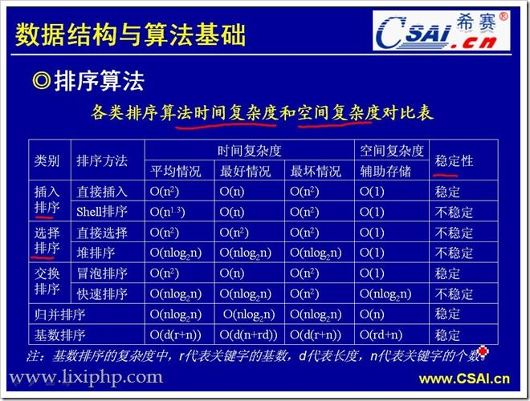

不稳定算法：    
直接选择排序、堆排序、快速排序、shell插入排序   


    直接插入排序：     稳定      n2 
    二分插入排序：     稳定      n2 
    shell（希尔）排序：不稳定       （最好n，最坏n^2）


    直接选择排序：     不稳定       n2  
    树型选择：                     nlog2n   
    堆排序：           不稳定       nlog2n  


    冒泡排序：          稳定       n2   
    快速排序：          不稳定      nlog2n  
    归并排序；          稳定        nlog2n  


        


选择排序：
选择排序是不稳定的排序方法。    
时间复杂度：最好和平均情况下都是O(n²）  
数量比较小时的最佳选择
```Python
def test(nums, n)
    for i in range(n):
        max_index = i
        for j in range(i, n):
            if nums[j] > nums[max_index]:
                max_index = j
        if max_index != i:
            temp = num[i]
            num[i] = num[max_index]
            num[max_index] = temp
```


直接插入排序：
把n个待排序的元素看成为一个有序表和一个无序表。开始时有序表中只包含1个元素，
无序表中包含有n-1个元素，排序过程中每次从无序表中取出第一个元素，将它插入到
有序表中的适当位置，使之成为新的有序表，重复n-1次可完成排序过程。   

直接插入排序是稳定的排序算法。  
时间复杂度：最好情况(初始情况就是正序)下是o(n),平均情况是o(n²)  

for i in range(1, n):
    if nums[i] < nums[i-1]:
        temp = nums[i]
        for j in range(i, 0, -1):
            if nums[j] < nums[j-1]:
                nums[j] = nums[j-1]
            else:
                break
        nums[j] = temp 


二分插入选择：
算法的基本过程：
（1）计算 0 ~ i-1 的中间点，用 i 索引处的元素与中间值进行比较，如果 i 索引处的元素大，
    说明要插入的这个元素应该在中间值和刚加入i索引之间，反之，就是在刚开始的位置 到中间值的位置，这样很简单的完成了折半；
（2）在相应的半个范围里面找插入的位置时，不断的用（1）步骤缩小范围，不停的折半，
    范围依次缩小为 1/2 1/4 1/8 .......快速的确定出第 i 个元素要插在什么地方；
（3）确定位置之后，将整个序列后移，并将元素插入到相应位置。

二分插入排序是稳定的排序算法。  
时间复杂度：最好情况(刚好插入位置为二分位置)下是O(log₂n),平均情况和最坏情况是o(n²)  

for i in range(1, n):
    if nums[i] < nums[i-1]:
        temp = nums[i]
        left = 0
        right = i - 1
        while left <= right:
            mid = (left+right) // 2
            if nums[mid] < temp:
                left = mid + 1
            elif nums[mid] > temp:
                right = mid - 1
            else:
                left = mid
        for j in range(i, left, -1):
            nums[j] = nums[j-1]
        nums[left] = temp


冒泡排序：  
冒泡排序是一种稳定排序算法。    
时间复杂度:最好情况(初始情况就是正序)下是o(n),平均情况是o(n²)   
```Python
def bubble_sort2(arr):
    for j in range(len(arr) - 1, 0, -1):
        for i in range(0, j):
            if arr[i] > arr[i + 1]:
                arr[i], arr[i + 1] = arr[i + 1], arr[i]

```


shell 排序：
希尔排序是把记录按下标的一定增量分组，对每组使用直接插入排序算法排序；
随着增量逐渐减少，每组包含的关键词越来越多，当增量减至1时，整个文件恰
被分成一组，排序完成。

希尔排序是非稳定排序算法。  
时间复杂度：O(n^（1.3—2）)  

increment = count // 3 + 1
flag = 0
while increment >= 1:
    for i in range(increment, count ):
        temp = nums[i]
        j = i
        while j >= increment and nums[j-increment] > temp:
            nums[j] = nums[j-increment]
            j -= increment
        nums[j] = temp
    if flag == 1:
        break
    increment = count //3 + 1
    if increment == 1:
        flag = 1


快速排序
它的基本思想是：通过一趟排序将要排序的数据分割成独立的两部分，
其中一部分的所有数据都比另外一部分的所有数据都要小，然后再按
此方法对这两部分数据分别进行快速排序，整个排序过程可以递归进行，
以此达到整个数据变成有序序列。

快速排序是非稳定的排序算法  
时间复杂度：最差为O(n^2)，平均为O(nlogn)，最好为O(nlogn)    
空间复杂度： O(log2n)~O(n)  
```python
def quicksort(nums, left, right):
    if left > right:
        return
    temp = nums[left]
    i = left
    j = right
    while i != j:
        # 从右往左找第一个小于temp的数
        while nums[j] >= temp and i < j:
            j -= 1
        # 从左往右找第一个大于temp的数
        while nums[i] <= temp and i < j:
            i += 1
        if i < j:
            t = nums[i]
            nums[i] = nums[j]
            nums[j] = t
    nums[left] = nums[i]
    nums[i] = temp
    quicksort(nums, left, i-1)
    quicksort(nums, i+1, right)


# 链表快排
class Solution():
    """快排类"""
    def __init__(self):
        pass

    # end 初始为 None
    def quicksorted(self, head, end):
        if head != end:
            node = self.partition(head, end)          # 先挖坑填数
            self.quicksorted(head, node)              # 递归调用
            self.quicksorted(node.next, end)          # 递归调用

    def partition(self, head, end):
        p1, p2 = head, head.next        # p2是遍历指针，p1是小数的指针

        while p2 != end:
            if p2.value < head.value:
                p1 = p1.next

                tmp = p2.value
                p2.value = p1.value
                p1.value = tmp
            p2 = p2.next

        tmp = head.value
        head.value = p1.value
        p1.value = tmp

        return p1

```

堆排序：
是指利用堆这种数据结构所设计的一种排序算法。
堆是一个近似完全二叉树的结构，并同时满足堆积
的性质：即子结点的键值或索引总是小于（或者大于）它的父节点

在堆的数据结构中，堆中的最大值总是位于根节点（在优先队列
中使用堆的话堆中的最小值位于根节点）。堆中定义以下几种操作：

最大堆调整（Max Heapify）：将堆的末端子节点作调整，
                        使得子节点永远小于父节点
创建最大堆（Build Max Heap）：将堆中的所有数据重新排序
堆排序（HeapSort）：移除位在第一个数据的根节点，
                   并做最大堆调整的递归运算


堆排序是一个非稳定的排序算法。
时间复杂度：O(nlogn)    
空间复杂度：O(1)
初始化建堆过程时间：O(n)    
一般升序采用大顶堆，降序采用小顶堆（父节点大：大堆）


```Python
# 最大堆   
def max_heap(nums, start, end): 
    # 父节点   
    dad = start
    # 左孩子， 不一定存在（只有一个根节点）
    son = dad * 2 + 1
    while son <= end:
        # 比较左右孩子的大小
        if son+1 <= end and nums[son] < nums[son+1]:
            # 右孩子
            son += 1
        # 如果父节点大于子节点表示调整完毕，直接跳出函数
        # 因为是从最后一个父节点往前调整，所有可以这样判断是否全部调整完
        if nums[dad] > nums[son]:
            return 
        else:
            # 交换节点
            nums[dad], nums[son] = nums[son], nums[dad]
            dad = son
            son = dad * 2 + 1
            
def heap_sort(nums, n):
    # 初始化，从最後一个父节点开始调整
    # 最后一个父节点的下标
    last_parent_node = n//2 -1
    for i in range(last_parent_node, -1, -1):
        max_heap(nums, i, n - 1)
    # n-1是最后一个元素的位置
    for j in range(n-1, 0, -1):
        # 把最大元素放到尾部
        nums[0], nums[j] = nums[j], nums[0] 
        max_heap(nums, 0, j-1)


```     
# 归并排序：  
- 时间复杂度为O(nlog2n)
- 空间复杂度为O(n)
```Python
def merge(left, right):
    res = []
    while left and right:
        if left[0] < right[0]:
            res.append(left.pop(0))
        else:
            res.append(right.pop(0))
    # left 或 right 为空
    res = res + left + right
    return res


def merge_sort(nums):
    size = len(nums)
    if size <= 1:
        return nums

    mid = size // 2
    left = merge_sort(nums[:mid])
    right = merge_sort(nums[mid:])
    return merge(left, right)


# 链表归并
class Solution1():
    """归并排序类"""
    def __init__(self):
        pass

    def mergesort(self, head):
        if head is None or head.next is None:
            """链表为空或仅有一个节点，直接返回结果"""
            return head
        mid = self.getmid(head)
        right = mid.next
        mid.next = None

        mer1 = self.mergesort(head)
        mer2 = self.mergesort(right)
        result = self.merge(mer1, mer2)
        return result

    def getmid(self, head):
        """使用快慢指针寻找链表中间节点"""
        if head is None or head.next is None:
            return head

        fast = head
        slow = head

        try:
            while fast.next.next is not None and slow.next is not None:
                fast = fast.next.next
                slow = slow.next
        except:
            pass
        return slow

    def merge(self, head1, head2):
        """对两个链表进行归并，比较两个链表当中的值，合并到一个新的链表当中"""
        p1 = head1
        p2 = head2
        if head1.value < head2.value:
            head = head1
            p1 = p1.next
        else:
            head = head2
            p2 = p2.next

        p = head                                # 新生成的头指针不能动, 由p来进行移动
        while p1 is not None and p2 is not None:
            if p1.value < p2.value:
                p.next = p1
                p1 = p1.next
                p = p.next
            else:
                p.next = p2
                p2 = p2.next
                p = p.next

        if p1 is not None:
            p.next = p1
        else:
            p.next = p2
        return head


if __name__ == '__main__':
    print(merge_sort([2, 3, 1, 55, 23, 44]))
```


有n个数， 第x次查找成功的节点数有:  
2 ** (x-1) - (2 ** x - 1 - n)   