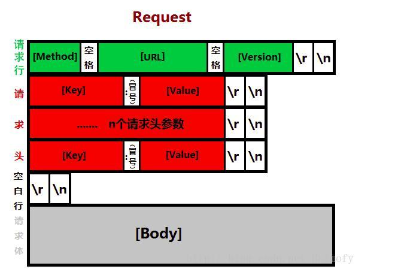
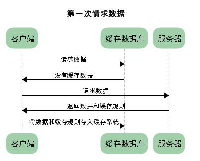
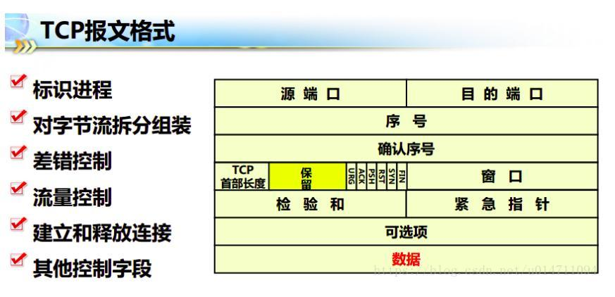
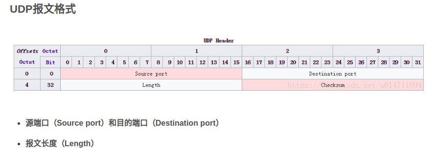
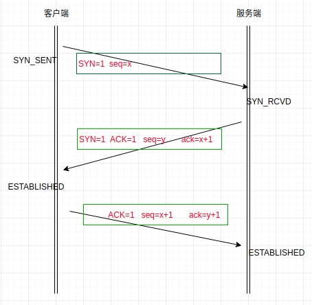
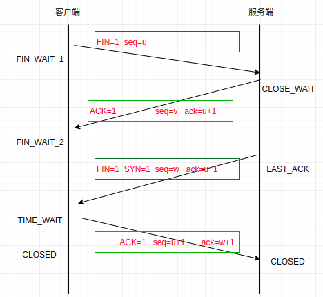

## get、post   
- get：用于获取数据，请求指定的页面信息，并返回响应主体   
- post：一般用于将数据发给服务器；数据在地址栏不可见
- 区别：
    - get请求数据通过域名后缀url传送，用户可见，不安全；  
    - post请求数据通过在请求报文正文里传输，相对比较安全。    
    - get传递数据量有限。 
    - post会有浏览器提示重新提交表单的问题，get则没有。   
    - get执行效率比post高。   
    - 数据查询用get，数据增、删、改用post     

## 安全、幂等
- RFC7231里定义了HTTP方法的几个性质：
    - 安全：请求如果使用了是安全的方法，就不应该引起服务端任何的状态变化
        - 安全的 HTTP 方法不会改变服务器状态，也就是说它只是可读的
    - 幂等： 一个请求方法执行多次和仅执行一次的效果完全相同。
        - 幂等的 HTTP 方法，同样的请求被执行一次与连续执行多次的效果是一样的，服务器的状态也是一样的
    - 可缓存性： 一个方法是否可以被缓存（get、head ）
- GET 方法是安全的，而 POST 不是。        
- 所有的安全方法都是幂等的      
- 在正确实现的条件下，GET，HEAD，PUT 和 DELETE 等方法都是幂等的，而 POST 方法不是。   
- get 可以缓存，幂等

## Http请求类型：  
+ OPTIONS：返回服务器针对特定资源所支持的HTTP请求方法。     
        也可以利用向Web服务器发送'*'的请求来测试服务器的功能性。         
+ HEAD：向服务器索要与GET请求相一致的响应，只不过响应体将不会被返回。     
        这一方法可以在不必传输整个响应内容的情况下，就可以获取包含在       
        响应消息头中的元信息.   
+ GET：向特定的资源发出请求。   
+ POST：向指定资源提交数据进行处理请求（例如提交表单或者上传文件）。    
        数据被包含在请求体中。      
+ PUT：向指定资源位置上传其最新内容。   
        由于自身不带验证机制，任何人都可以上传文件，因此存在安全问题。   
+ DELETE：请求服务器删除Request-URI所标识的资源。与put功能相反      
+ TRACE：回显服务器收到的请求，主要用于测试或诊断。         
+ PATCH：对资源进行部分修改。   
+ CONNECT：HTTP/1.1协议中预留给能够将连接改为管道方式的代理服务器。     

## http 、https
- request
    

- HTTP(超文本传输协议):
    - 一直用于分布式、 协作式和超媒体信息系统的应用层协议。
    - 默认工作在tcp协议80端口。         
    - 简单来说就是一种发布和接收HTML页面的方法，被用于在web浏览器和网站服务器之间传递信息。     
    - HTTP协议以明文方式发送内容，不提供任何方式的数据加密，
    - 如果攻击者截取了web浏览器和网站服务之间的传输报文，就可以直接读懂其中的信息，
    - 因此HTTP协议不适合传输敏感信息。          

- HTTPS
    - 一种透过计算机网络进行安全通信的传输协议。
    - HTTPS默认工作在tcp协议的443端口
    - HTTPS经由HTTP进行通信，但利用SSL/TLS（SSL：安全套接层， TLS：传输层安全协议）来加密数据包。      
    - HTTPS开发的主要目的，是提供对网站服务器的身份认证，保护交换数据的隐私和完整性。       

- https加密过程
    - 对称加密：使用相同密钥对报文进行加密解密
    - 非对称加密：加密和解密是需要不同的秘钥    
    - 加密过程：
        - 客户端发起握手请求，以明文传输请求信息，包含版本信息，加密-套件候选列表，压缩算法候选列表，随机数，扩展字段等信息。
        - 服务器必须要有一套数字证书，可以自己制作，也可以向组织申请。（这套证书其实就是一对公钥和私钥）
        - 服务端返回协商的信息结果，包括选择使用的协议版本 version，选择的加密套件 cipher suite，
            选择的压缩算法 compression method、随机数 random_S 以及证书（即公钥yue）。  
        - 客户端验证证书的合法性，包括可信性，是否吊销，过期时间和域名。    
        - 客户端使用公匙对对称密匙加密，发送给服务端。
        - 服务器用私钥解密，拿到对称加密的密匙。
        - 服务器发送加密后的信息，这部分信息就是服务端用私钥加密后的信息，可以在客户端用随机值解密还原。 
        - 客户端解密信息。      

- https 工作流程    
    - TCP三次同步握手       
    - 客户端验证服务器证书      
    - DH算法协商对称加密算法的密钥、hash算法的密钥  
    - SSL安全加密隧道完成          
    - 网页以加密的方式传输，用协商的对称加密算法对密钥加密，保证数据机密性；           
        用协商的hash算法进行数据完整性保护，保证数据不被篡改。
    - 四次挥手    
    
- 区别：          
    - HTTP明文传输，数据都是未加密的，安全性差，HTTPS数据传输过程是加密的，安全性较好。          
    - HTTP页面响应速度比HTTPS快，主要是因为HTTP使用tcp三次握手建立连接，    
        客户端和服务端交换3个包。而HTTPS除了TCP的三个包，还要加上ssl握手的9个包。              
    - 使用端口不同，http用80，https用443            
    - HTTPS其实就是建构在SSL/TLS之上的HTTP协议，更加占用服务器资源。         

- http 缓存
    - 第一次请求时
         
    - 强制缓存
        -  
        - http1.1 中 Cache-Control 字段说明缓存规则
            - private: 客户端可以缓存
            - public: 客户端和代理服务器都可缓存
            - max-age=xxx: 缓存的内容将在 xxx 秒后失效
            - no-cache: 需要使用对比缓存来验证缓存数据
            - no-store:  所有内容都不会缓存，强制缓存，对比缓存都不会触发 

    - 对比缓存
        -  
        - Last-Modified  /  If-Modified-Since
            - Last-Modified：服务器在响应请求时，告诉浏览器资源的最后修改时间
            - If-Modified-Since：再次请求服务器时，通过此字段通知服务器上次请求时服务器返回的资源最后修改时间
                - 服务器收到请求后发现有头If-Modified-Since 则与被请求资源的最后修改时间进行比对
                - 大于， 说明资源又被改动过，则响应整片资源内容，返回状态码200
                - 小于或等于， 说明资源无新修改，则响应HTTP 304
        - Etag  /  If-None-Match（优先级高于Last-Modified  /  If-Modified-Since）   
            - Etag：服务器响应请求时，告诉浏览器当前资源在服务器的唯一标识（生成规则由服务器决定）
            - If-None-Match：再次请求服务器时，通过此字段通知服务器客户段缓存数据的唯一标识
                - 服务器收到请求后发现有头If-None-Match 则与被请求资源的唯一标识进行比对
                - 不同，说明资源又被改动过，则响应整片资源内容，返回状态码200
                - 相同，说明资源无新修改，则响应HTTP 304，告知浏览器继续使用所保存的cache

## http 头部可以包含二进制吗
- http 1.1 是文本格式， http2 是二进制格式

## 证书和公钥的关系
- 数字证书签发系统（CA系统），在生成数字证书的同时，还会随机生成一对密钥，一个私钥，一个公钥。

## tcp、udp
- tcp
    
- udp       
       

- TCP和UDP的相同点：
    - TCP和UDP都是传输层协议，双方的通信都需要开放端口。

- 区别
    - tcp 面向连接，udp面向无连接
    - TCP提供可靠的服务；UDP不保证可靠交付
    - TCP对系统资源要求较多，UDP对系统资源要求较少。
    - 每一条TCP连接只能是点到点的;UDP支持一对一，一对多，多对一和多对多的交互通信
    - UDP具有较好的实时性，工作效率比TCP高，适用于对高速传输和实时性有较高的通信或广播通信。    

- TCP和UDP的不同点：   
    - TCP的传输是可靠传输。	UDP的传输是不可靠传输。 
    - TCP是基于连接的协议，在正式收发数据前，必须和对方建立可靠的连接。     
        UDP是和TCP相对应的协议，它是面向非连接的协议，它不与对方建立连接，而是直接把数据包发送出去      
    - TCP是一种可靠的通信服务，负载相对而言比较大，TCP采用套接字（socket）或者端口（port）来建立通信。  	    
        UDP是一种不可靠的网络服务，负载比较小。     
    - TCP和UDP结构不同，TCP包括序号、确认信号、数据偏移、控制标志       
        （通常说的URG、ACK、PSH、RST、SYN、FIN）、窗口、校验和、紧急指针、选项等信息。      	
        UDP包含长度和校验和信息。       
    - TCP提供超时重发，丢弃重复数据，检验数据，流量控制等功能，保证数据能从一端传到另一端。	     
        UDP不提供可靠性，它只是把应用程序传给IP层的数据报发送出去，但是并不能保证它们能到达目的地。     
    - TCP在发送数据包前在通信双方有一个三次握手机制，确保双方准备好，在传输数据包期间，TCP会根据链  
        路中数据流量的大小来调节传送的速率，传输时如果发现有丢包，会有严格的重传机制，故而传输速度很慢。    	
        UDP在传输数据报前不用在客户和服务器之间建立一个连接，且没有超时重发等机制，故而传输速度很快。   
    - TCP支持全双工和并发的TCP连接，提供确认、重传与拥塞控制。	    
        UDP适用于那些系统对性能的要求高于数据完整性的要求，需要“简短快捷”的数据交换、需要多播和广播的应用环境。 

## TCP可靠传输
 - 停止等待协议:每发送完一个分组就停止发送，等待对方的确认。在收到确认后再发送下一个分组。
 - 自动重传请求(ARQ)
  - 分组丢失：超时计时器到期后重新发送分组
  - 确认丢失：发送方重传分组；接收方丢弃重复分组，并向发送方发送确认报文。
  - 确认迟到：A会再一次收到B的确认报文，这时候A收下并丢弃这个确认报文，并不做什么。

-----   
 - 滑动窗口协议 与 连续ARQ协议：
  > 发送方和接收方各自维持着发送窗口和接受窗口，发送方每收到一个确认，  
    就把发送窗口向前滑动一个分组的位置。接收方一般采用累计确认方式，    
    即接收方不必对收到的分组逐个发送确认，而是可以在收到几个分组后，    
    对按序到达的最后一个分组发送确认。  
  - 流量控制：
    > 接收方发送的确认报文中的窗口字段可以用来控制发送方窗口大小，从而影响发送方的发送速率。
        将窗口字段设置为 0，则发送方不能发送数据。  
    - 持续计时器: 避免 0 窗口后的死锁
  - 拥塞控制：
    > 发送方维护一个叫做拥塞窗口（cwnd）的状态变量
    - 慢开始、拥塞避免
        - 发送的最初执行慢开始，令 cwnd = 1，发送方只能发送 1 个报文段；
            当收到确认后，将 cwnd 加倍，因此之后发送方能够发送的报文段数量为：2、4、8 ...   
        - 设置一个慢开始门限 ssthresh，当 cwnd >= ssthresh 时，进入拥塞避免，每个轮次只将 cwnd 加 1。
        - 如果出现了超时，则令 ssthresh = cwnd / 2，然后重新执行慢开始。
    - 快重传、快恢复
        - 在发送方，如果收到三个重复确认，那么可以知道下一个报文段丢失，此时执行快重传，立即重传下一个报文段。
        - 在这种情况下，只是丢失个别报文段，而不是网络拥塞。因此执行快恢复，
            令 ssthresh = cwnd / 2 ，cwnd = ssthresh，注意到此时直接进入拥塞避免。

## 接收方如何确保有序
- 缓冲区
- 序列号

## tcp校验和
> 在tcp的首部之前，多了一个12字节的伪首部，伪首部中4个字节保存源ip信息，4个字节目的ip信息，
  一个字节的保留位置，一个字节保存协议号（6代表tcp，17代表udp），2个字节保存tcp的真正首部和数据。
  通过位运算，得到了一个校验和数据，保存在tcp报文的checksum字段。

  ps：tcp校验和与ip校验和的区别是：TCP和UDP检验和覆盖首部和数据，   
    而IP首部中的检验和只覆盖IP的首部，不覆盖IP数据报中的任何数据。  

## 粘包问题的解决策略
- 消息定长，例如每个报文的大小为固定长度200字节，如果不够，空位补空格；  
- 在包尾增加回车换行符进行分割，例如FTP协议；
- 将消息分为消息头和消息体，消息头中包含表示消息总长度（或者消息体长度）的字段，
    通常设计思路为消息头的第一个字段使用int32来表示消息的总长度；       

## 握手、挥手

三次握手：      

+ 为什么不能用两次握手建立连接？  
可能发生已失效的连接请求又传送到服务器端，从而产生错误：        
客户端发送的SYN包经过一定时间才到达服务端，服务端收到SYN包后，          
向客户端发送确认包，认为连接建立，造成服务端资源浪费。  

四次挥手：      
  
+ 为什么连接的时候是三次握手，关闭的时候却是四次握手？    
当服务端收到客户端的SYN连接请求报文后，可以直接发送SYN+ACK报文。         
其中ACK报文是用来应答的，SYN报文是用来同步的。但是关闭连接时，        
当服务端收到FIN报文时，不会立即关闭socket，只能回复一个ACK报文，     
当数据全部传输完成后，再回复FIN报文，因此需要四次握手。             

+ 为什么TIME_WAIT状态需要经过2MSL(最大报文段生存时间)才能返回到CLOSE状态？    
网络不一定可靠，最后一个ACK包有可能丢失。如果服务端没有收到ACK包，    
将不断发送FIN片段，所以客户端不能立即关闭，它必须确认服务端收到ACK      
包。客户端在发送ACK包后，进入TIME_WAIT状态，等待2MSL时间，如果在       
该时间内再次收到FIN包，客户端就会重发ACK包并再次等待2MSL。      

- 防止客户端最后一次发给服务器的确认在网络中丢失以至于客户端关闭，而服务端并未关闭，导致资源的浪费。
- 等待最大的2msl可以让本次连接的所有的网络包在链路上消失，以防造成不必要的干扰。
	> 如果client直接closed，然后又向server发起了一个新连接，我们不能保证这个新连接和刚关闭的连接的端口号是不同的。假设新连接和已经关闭的老端口号是一样的，如果前一次滞留的某些数据仍然在网络中，这些延迟数据会在新连接建立后到达Server，所以socket就认为那个延迟的数据是属于新连接的，数据包就会发生混淆。所以client要在TIME_WAIT状态等待2倍的MSL，这样保证本次连接的所有数据都从网络中消失。		

+ 如果已经建立了连接，但是客户端突然出现故障了怎么办？      
TCP设有保活计时器，一般为2个小时，如果这段时间内一直没有数据传输，      
服务端会每隔75s发送一个探测报文段，如果在发送10个报文段后仍然没有     
回应，就会关闭连接。       

##　大量Time_wait的解决：
- 使用长连接，不要用短连接
- net.ipv4.tcp_syncookies = 1 表示开启SYN Cookies
- net.ipv4.tcp_tw_reuse = 1 表示开启重用
- net.ipv4.tcp_tw_recycle = 1 表示开启TCP连接中TIME-WAIT sockets的快速回收
- net.ipv4.tcp_fin_timeout 修改系統默认的 TIMEOUT 时间  

## 如果服务器和客户端一起断开怎么办
- 三次握手、四次挥手
- 客户端意外断开：客户端会定时发送心跳包给服务端，以保持连接，当服务端一定时间内没有收到客户端发来的心跳包后，  
    判断客户端已经断开，主动close。 

- 如果没有time_wait， 回复RST 包（发生的条件如下）
    - 建立连接的SYN到达某端口，但是该端口上没有正在监听的服务
    - TCP想取消一个已有连接
    - TCP接收到了一个根本不存在的的连接上的分节    

- TIMEWAIT期间如果收到fin会继续回复一个ack，并重置等待时间。收到其它数据包返回rst。 

## 什么是 SYN flood 攻击，如何避免
- SYN Flood（半开放攻击）：一种拒绝服务（DDoS）攻击，其目的是通过消耗所有可用的服务器资源使服务器不可用于合法流量。
- SYN flood 攻击：直接攻击、欺骗性攻击、分布式攻击
    - 攻击者向目标服务器发送大量SYN数据包，通常会使用欺骗性的IP地址
    - 服务器响应每个连接请求，并留下开放端口准备好接收响应
    - 攻击者继续发送更多的SYN数据包，消耗完服务器所有可以端口，使服务器无法正常工作。

- 避免：
    - 增加积压队列：增加操作系统允许的可能半开连接的最大数量。缺点：系统必须预留额外的内存资源来处理所有新的请求。
    - 回收最早的半开TCP连接：覆盖最早的半开式连接。缺点：要求合法连接可以在更短的时间内完全建立。
    - SYN cookie：服务器使用SYN-ACK数据包对每个连接请求进行响应，然后从积压中删除SYN请求，
                从存储器中删除请求并使端口打开，准备建立新的连接。如果连接是合法请求，并且最
                终的ACK数据包从客户端计算机发送回服务器，则服务器将重建（有一些限制）SYN积压队列条目。  

