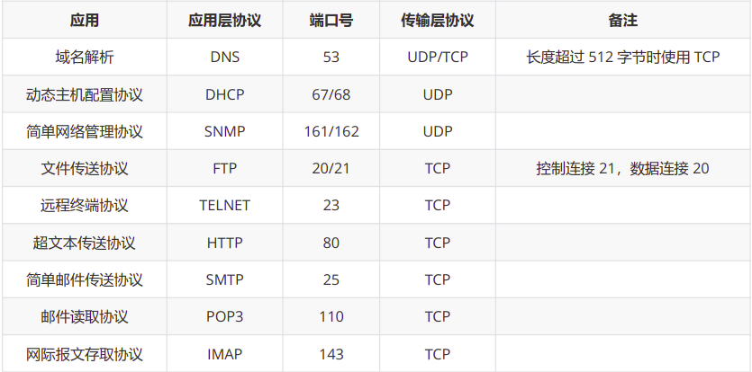

## 状态码：    
- 1xx：信息性状态码，接收的请求正在处理       
- 2xx：成功状态码，请求正常处理完毕   
- 3xx：重定向，需要进行附加操作以完成请求     
- 4xx：客户端出错 ，服务器无法处理请求            
- 5xx：服务端出错 ，服务器处理请求出错    

- 100:请求继续    
- 101：切换协议   

- 200：请求成功   
- 201：成功请求并创建了新的资源   
- 202：已经接受请求，但未完成处理     
- 204：服务器成功处理，但未返回内容   
- 206：服务器成功处理了部分get请求    

- 300：多种选择。     
- 301：永久重定向            
- 302：临时重定向     
- 303：和302类似，要求客户端采用get方法获取资源   
- 304：请求的资源未修改   

- 400：客户端请求的语法错误，服务器无法理解     
- 401：请求要求用户的身份认证(用户名或密码错误)    
- 403：请求被拒绝     
- 404：服务器无法根据客户端的请求找到资源     
- 405：客户端请求的方法被禁止     

- 500：服务器内部错误，无法完成请求   
- 501：服务器不支持请求的功能，无法完成请求 
- 502：bad gateway 顾名思义 网关错误 
    - 作为网关或者代理工作的服务器尝试执行请求时，从上游服务器接收到无效的响应。
    - 原因：
        - web服务器没有启动(定位：日志；查看端口是否启动)
        - web服务器请求太多，响应不了这个请求(定位：日志)
            - 适当增加max_children参数
            > max_children最大子进程数，在高并发请求下，达到php-fpm最大响应数，后续的请求就会出现502错误的。    
        - 数据库死锁
        - php-fpm没有启动,nginx无法将请求交给php-fpm    
        - php-fpm运行脚本超时，php-fpm终止了脚本的执行和执行脚本的Worker进程，nginx发现自己与php-fpm的连接断开。
- 503：由于超载或系统运维，服务器暂时无法处理请求。   
- 504：gateway time-out 顾名思义 网关超时
    - 作为网关或者代理工作的服务器尝试执行请求时，未能及时从上游服务器（URI标识出的服务器，例如HTTP、FTP、LDAP）
        或者辅助服务器（例如DNS）收到响应。 
    - nginx超过了自己设置的超时时间，不等待php-fpm的返回结果，直接给客户端返回504错误。
    - fastcgi_connect_timeout:指定连接到后端FastCGI的超时时间
    - fastcgi_send_timeout:向FastCGI传送请求的超时时间
    - fastcgi_read_timeout:接收FastCGI应答的超时时间

- php-fpm: PHP FastCGI 进程管理器，用于管理PHP 进程池的软件，用于接受web服务器的请求。  
- FastCGI:与语言无关的、可伸缩架构的CGI开放扩展，其主要行为是将CGI解释器进程保持在内存中并因此获得较高的性能。  

## DNS解析（udp）
DNS解析（udp, 应用层）：根域名服务器、顶级域名服务器、权限域名服务器、本地域名服务器        

主机到本地域名服务器：递归查询：     
    如果主机所询问的本地域名服务器不知道被查询的域名的IP地址，那么本地域名          
    服务器就以DNS客户的身份，向其它根域名服务器继续发出查询请求报文(即替主      
    机继续查询)，而不是让主机自己进行下一步查询。因此，递归查询返回的查询结     
    果或者是所要查询的IP地址，或者是报错，表示无法查询到所需的IP地址。      

本地域名服务器->根域名服务器 : 迭代查询     
    本地域名服务器-》根域名服务器-》本地域名服务器-》顶级域名服务器-》         
    本地域名服务器-》权限域名服务器-》本地域名服务器-》主机     

1. 递归查询：本机向本地域名服务器发出一次查询请求，就静待最终的结果。如果本地域名服务器无法解析，   
    自己会以DNS客户机的身份向其它域名服务器查询，直到得到最终的IP地址告诉本机.     
2. 迭代查询：本地域名服务器向根域名服务器查询，根域名服务器告诉它下一步到哪里去查询，   
    然后它再去查，每次它都是以客户机的身份去各个服务器查询。    

## 输入url后
<!--  
url encode（处理中文字符）  
iso-8859-1 encode 编码成二进制文件  
再随请求头发送出去  
服务端解码
-->
+ DNS解析
    1. 浏览器缓存–>系统缓存–>路由器缓存
    2. DNS服务器查询
+ TCP连接
+ 向服务器发送请求  
    包括：  
    + 请求行：请求行中包括请求的方法，路径和协议版本。    
    + 请求头：请求头中包含了请求的一些附加的信息，一般是以键值的形式成对存在，比如设置请求文件的类型accept-type，以及服务器对缓存的设置。     
    + 空行：协议中规定请求头和请求主体间必须用一个空行隔开    
    + 请求主体：对于post请求，所需要的参数都不会放在url中，这时候就需要一个载体了，这个载体就是请求主体。   
+ 服务器返回请求内容    
    包括：  
    + 响应行：响应报文的起始行同样包含了协议版本，与请求的起始行不同的是其包含的还有状态码和状态码的原因短语。    
    + 响应头：对应请求报文中的请求头，格式一致，但是各自有不同的首部。也有一起用的通用首部。      
    + 空行     
    + 报文主体：请求所需要的资源。        
+ 浏览器开始解析渲染页面并显示  
+ 关闭连接

ps:url 会对非ASCILL码字符以及保留字 encode， 这样是为了方便url解析， 解码时先拆分url 再解码         

## OSI
通信方式:   
单工通信：单向传输  
半双工通信：双向交替传输    
全双工通信：双向同时传输        

总时延 = 排队时延 + 处理时延 + 传输时延 + 传播时延  

# OSI
- **应用层**    
    1. DNS 可以使用 UDP 或者 TCP 进行传输，使用的端口号都为 53。大多数情况下 DNS 使用 UDP 进行传输。
    2. FTP 使用 TCP 进行连接，它需要两个连接来传送一个文件
        - 控制连接：服务器打开端口号 21 等待客户端的连接，客户端主动建立连接后，使用这个连接将客户端的命令传送给服务器，并传回服务器的应答。
        - 数据连接：用来传送一个文件数据。
            - 主动模式：服务器端主动建立数据连接，服务器端的端口号为 20，客户端的端口号随机
            - 被动模式：客户端主动建立数据连接，其中客户端的端口号由客户端自己指定，服务器端的端口号随机
    3. 远程登录协议TELNET
    4. 动态主机配置协议（DHCP ）
    5. 电子邮件协议
        - 一个电子邮件系统由三部分组成：用户代理、邮件服务器以及邮件协议。
        - 邮件协议包含发送协议和读取协议，发送协议常用 SMTP，读取协议常用 POP3 和 IMAP。
            - SMTP：只能发送ASCII码，使用互联网邮件扩充 MIME 可以发送二进制文件。
            - POP3：只要用户从服务器上读取了邮件，就把该邮件删除。
            - IMAP:客户端和服务器上的邮件保持同步，如果不手动删除邮件，那么服务器上的邮件也不会被删除。

- **表示层**
- **会话层**
- **传输层**
    1. tcp面向连接，udp面向无连接
    2. tcp可靠传输：
        - TCP 使用超时重传来实现可靠传输。
        - 如果一个已经发送的报文段在超时时间内没有收到确认，那么就重传这个报文段。
    3. tcp滑动窗口  
        - 窗口是缓存的一部分，用来暂时存放字节流。
        - 接收方通过 TCP 报文段中的窗口字段告诉发送方自己的窗口大小，发送方根据这个值和其它信息设置自己的窗口大小。
        - 如果发送窗口左部的字节已经发送并且收到了确认，那么就将发送窗口向右滑动一定距离，直到左部第一个字节不是已发送并且已确认的状态
        - 接收窗口只会对窗口内最后一个按序到达的字节进行确认
    4. tcp流量控制
        - 流量控制是为了控制发送方发送速率，保证接收方来得及接收。
        - 接收方发送的确认报文中的窗口字段可以用来控制发送方窗口大小，从而影响发送方的发送速率。
        - 将窗口字段设置为0，则发送方不能发送数据。
    5. tcp拥塞控制
        - 如果网络出现拥塞，分组将会丢失，此时发送方会继续重传，从而导致网络拥塞程度更高。 
        - 流量控制是为了让接收方能来得及接收，而拥塞控制是为了降低整个网络的拥塞程度。
        - TCP 主要通过四个算法来进行拥塞控制：慢开始、拥塞避免、快重传、快恢复。

- **网络层**    
    1. ip协议   
        - 地址解析协议 ARP（Address Resolution Protocol）
        - 网际控制报文协议 ICMP（Internet Control Message Protocol）
        - 网际组管理协议 IGMP（Internet Group Management Protocol） 
- **数据链路层**
    1. 封装成帧（将网络层传下来的分组添加首部和尾部，用于标记帧的开始和结束。）
    2. 透明传输（如果帧的数据部分含有和首部尾部相同的内容，需要转义）
    3. 差错检测（循环冗余检验CRC）
- **物理层**
    1. 通信方式:   
        - 单工通信：单向传输  
        - 半双工通信：双向交替传输    
        - 全双工通信：双向同时传输  
  

## OSI七层，数据链路层传输单位
- 网络层：包
- 数据链路层: 帧
- 物理层：比特

## 路由协议（网络层）
- RIP 协议（路由信息协议）：
    - 一种动态路由选择协议， RIP协议基于距离矢量算法，使用“跳数”来衡量到达目标地址的路由距离。
      这种协议的路由器只关心自己周围的世界，只与自己相邻的路由器交换信息，范围限制在15跳之内。
    - 局限：一条有效的路由信息的度量（metric）不能超过15，这就使得该协议不能应用于很大型的网络。
- OSPF 协议（开放式最短路径优先）：
    - 数据包：
        - HELLO 发现、建立、保活邻居
        - DBD 数据库描述包–主从关系的选举，共享本端路由信息的条目
        - LSR 链路状态查询包–询问对端本端所需要的未知网段的信息
        - LSU 链路状态更新包–回答对端的LSR，携带各类LSA
        - LSACK 链路状态确认包—接收到对端的LSU做出确认，保障可靠性

## ping的过程用到了什么协议？ICMP，是哪层的？（A ping B）
- ARP 协议（数据链路层）：A 先查自己的MAC地址表，如果没有B的MAC地址，就会向外发送一个ARP广播包
- ICMP 协议（网络层）：主要有两大功能：查询报文和差错报文。
    - 源抑制：
        - type = 4
        - 路由器在处理报文时会有一个缓存队列。如果超过最大缓存队列，将无法处理，从而丢弃报文。
    - 终点不可到达
        - type：3
        - code
            - 0：网络不可达
            - 1：主机不可达
            - 2：协议不可达   
            - 3：端口不可达
    - 超时：
        - type = 11
        - 网络传输IP数据报的过程中，如果IP数据包的TTL值逐渐递减为0时，需要丢弃数据报。
    - 路由重定向：type = 5

## 为什么ipv4的ip地址还没用完
- 子网划分
- NAT（网络地址转换） 技术
    - 网络被分为私网和公网两个部分，NAT网关设置在私网到公网的路由出口位置，双向流量必须都要经过NAT网关
    - 网络访问只能先由私网侧发起，公网无法主动访问私网主机
    - 三种类型
        - 静态NAT：通过手动设置，使 Internet 客户进行的通信能够映射到某个特定的私有网络地址和端口。
        - 动态NAT：为每一个内部的IP地址分配一个临时的外部IP地址；内网主机IP与全局IP地址是多对一的关系
        - NAT重载：把内部地址映射到外部网络的一个IP地址的不同端口上
    - 缺点：
        - 不能处理嵌入式IP地址或端口
        - 不能从公网访问内部网络服务

## listen 的第二个参数的作用，以及 Linux 内核如何实现
- int listen(int sockfd, int backlog)
- 参数sockfd是被listen函数作用的套接字
- 参数backlog规定了内核应该为相应套接口排队的最大连接个数（侦听队列的长度）
- 实现：
    - 未完成连接队列：当来自客户的SYN到达时，TCP在未完成连接队列中创建一个新项
    - 已完成连接队列：三路握手正常完成，该项就从未完成连接队列移到已完成连接队列的队尾。

## TCP三次握手和socket族函数怎么对应的？没有accept 会导致连接建立失败吗？
- socket相关函数：socket()、bind()、listen()、connect()、accept()、read()、write()、close()
- 服务器端在listen之前会调用bind()，而客户端就不会调用
        
- 客户端的connect在三次握手的第二个次返回，而服务器端的accept在三次握手的第三次返回。

- 不会，socket有两个队列，未完成连接队列，已完成连接队列，不accept能建立连接的大小就是后一个。

## shutdown和close区别
- close：导致相应描述符的引用计数减1，引用计数扔大于0，这个close调用并不会让TCP连接上发送一个FIN。
- shutdown：函数的行为依赖howto参数的值
    - shutdown(int sockfd,int howto)
        - SHUT_RD： 套接字中不再有数据可接收，而且套接字接收缓冲区中的现有数据都被丢弃。
        - SHUT_WR：半关闭，当前在套接字发送缓冲区中的数据将被发送掉，后跟TCP的正常连接终止序列。（不管套接字的引用计数是否等于0）
        - SHUT_RDWR：等于调用shutdown函数两次，连接的读半部和写半部都关闭。

## accept干什么用的
- 从处于 established 状态的连接队列头部取出一个已经完成的连接，如果这个队列没有已经完成的连接，accept()函数就会阻塞

## 阻塞IO和非阻塞IO，你怎么理解？哪个性能更好？或者说你觉得它们各自有什么特点？
- 阻塞IO：在读写数据过程中会发生阻塞现象（调用结果返回之前，当前线程会被挂起）
- 非阻塞IO：用户线程需要不断地询问内核数据是否就绪

- 非阻塞IO解决了服务端有很多不活跃连接
- 当连接不多时，并且每个连接都很活跃时，阻塞IO性能可能比非阻塞要好

## Cookie Session  
- Cookie是服务器发送到用户浏览器并保存在本地的一小块数据，它会在浏览器之后向同一服务器
    再次发起请求时被携带上，用于告知服务端两个请求是否来自同一浏览器。
- Session 存放在服务器端，当浏览器 第一次发送请求时，服务器自动
    生成一个Session和一个Session ID用来唯一标识这个Session，
    并将其通过响应发送到浏览器。当浏览器第二次发送请求，会将前一次
    服务器响应中的Session ID放在请求中一并发送到服务器上，服务器从
    请求中提取出Session ID，并和保存的所有Session ID进行对比，找到这个用户对应的Session。
-  Cookie 只能存储 ASCII 码字符串，而 Session 则可以存储任何类型的数据
- Session 相比Cookie更安全。    
- cookie数据保存在客户端，session数据保存在服务器端。
- cookie 有大小限制，每次请求时携带信息。

##　数据链路层和数据传输层的校验方法的区别
- 数据链路层
    - CRC校验：将传输的二进制数据除以某生成式，并将余数放到帧的尾部待接收方验证。
- 运输层：超时重传
- 数据链路层只保证接受到的数据没问题，不管中间丢失的数据；运输层会对中途丢失的数据也做管理。

## 长连接和短连接及适用情况
- 短连接：例如普通的web请求，在三次握手之后建立连接，发送数据包并得到服务器返回的结果之后，
        通过客户端和服务端的四次握手进行关闭断开。
- 长连接：执行三次握手链接后，不断开链接，保持客户端和服务端通信，  
        直到服务器超时自动断开链接，或者客户端主动断开链接。    

- 什么时候用长连接，短连接：
    - 长连接多用于操作频繁，点对点的通讯，而且连接数不能太多的情况。数据库的连接用长连接。
    - WEB网站的http服务一般都用短链接。因为长连接对于服务端来说会耗费一定的资源。

## 有了 MAC 地址，为什么还要用 IP 地址
> 当年设计出 IP 地址这个东西，就是因为随着网络中的设备逐渐增多，路由（也就是寻找数据包从发送方到接收方的路径）变得越来越困难了。于是想了一个办法，就是把网络划分成很多个子网。这样，在路由的时候，路由器可以把其他子网看成一个整体来进行计算。对于目的地在其他子网的数据包，路由器只需要让数据包到达那个子网即可，而剩下的工作就由子网内部解决了。虽然这种方法只能让寻找到的路径接近最优而不保证最优，不过它大大减少了路由器的计算量，利大于弊，所以被采用了。

> 如果我们只用 MAC 地址的话，路由器需要记住每个 MAC 地址所在的子网是哪一个（不然每一次收到数据包的时候路由器都要重新满世界地去找这个 MAC 地址的位置）。

> 和 MAC 不同的是，IP 地址是和地域相关的。对于位于同一个子网上的设备，我们给他们分配的 IP 地址前缀都是一样的。这个前缀就像邮政编码一样。这样，路由器过 IP 地址的前缀就能知道这个设备在哪个子网上了。现在，路由器只需要记住每个子网的位置即可，大大减少了路由器所需要的内存。

> 不能去掉 MAC 地址因为 IP 地址是要设备上线以后，才能根据他进入了哪个子网来分配的，在设备还没有 IP 地址的时候（或者分配 IP 地址的过程中），我们还需要用 MAC 地址来区分不同的设备。

> MAC 地址就像自己的 ID 号，而 IP 地址就像带着邮政编码的住址，各有各的用途。
