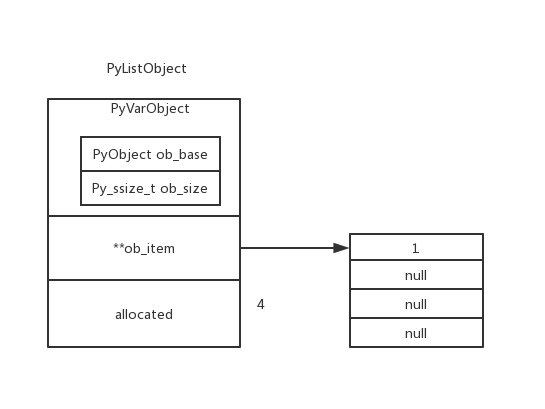
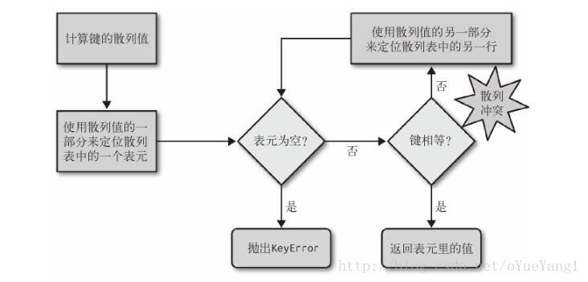
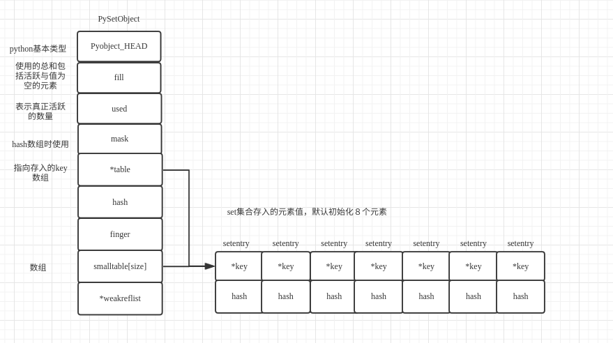

pyc 是一种二进制文件，是由py文件经过编译后，生成的文件，是一种byte code，py文件变成pyc文件后，加载的速度有所提高，而且pyc是一种跨 平台的字节码，是由python的虚拟机来执行的 。   
定义只有一个元素的tuple时，加逗号       
 float("inf"):正无穷大
 float("-inf"):负无穷      

递归时传入的参数是形参

\r ： return 到当前行的最左边。 
\n： newline 向下移动一行，并不移动左右。   

- %: 格式符
- %s是将变量传到str()函数中，结果是将变量转化适合人阅读的格式 
- %r是将变量传到repr()函数中，结果是将变量转化成适合机器阅读的格式，可以将%r后的变量理解为一个对象(外在表现：会给输出对象加上引号)    
___
- b" "： 后面字符串是bytes 类型。   
- u" ": 后面字符串以 Unicode 格式 进行编码，一般用在中文字符串前面，防止因为源码储存格式问题，导致再次使用时出现乱码。  
- f" ": 在字符串内支持大括号内的python 表达式   
- r" ": 去除转义字符    
len([1, 2,]) == 2

```Python
a = [0, 1]
a[1:1]
# output
# []
a[1:]
# output
# [1]
```

```Python
-7 // 3 == -3
-7 % 3 == 2

7 // -3 == -3
7 % -3 == -2
```

# functools

- ## 偏函数 functools.partial
    - 第一部分：函数；第二部分：可变参数；第三部分：关键字参数
    - 偏函数的第二个部分(可变参数)，按原有函数的参数顺序进行补充，参数将作用在原函数上，最后偏函数返回一个新函数
    - 偏函数的第三个部分(关键字参数)，按原有函数的关键字参数进行填补，参数将作用在原函数上，最后偏函数返回一个新函数
    - 与装饰器的区别是，偏函数产生了一个新函数，而装饰器动态给原函数增加功能。  

import copy     
浅拷贝：只拷贝顶级的对象，或者说父级对象    copy()      
深拷贝：拷贝所有的对象，顶级对象及其嵌套对象。或者说父级对象及其子对象   deepcopy()     

Python中的等号并不像很多静态语言一样是所谓“赋值”“修改”的含义，它是替换，是将一个引用指到一个新对象上去      
list 是一个容器，容器里面存放对每个对象的引用   
```Python
li = [1, 2]
# li[:] 表示对原对象的引用，此处语句作用类似 clear
li[:] = []
```
Python的参数传递是值传递还是引用传递:
- 不可变参数用值传递
- 可变参数是用引用传递

nohup python -u xx.py > log.out 2>&1 &

set没有append(),但可以用add()           
try except: 异常发生后程序会继续执行    
try except else : 不发生异常时会执行else语句    
for else: else从句会在for 循环正常结束时执行    

使用C扩展：CTypes、SWIG、Python/C API 

Python 字典 setdefault() 函数和 get()方法 类似, 如果键不存在于字典中，将会添加键并将值设为默认值。      

sort、sorted    
原理：Timsort算法（稳定），二分插入和归并的结合        


reverse -- 排序规则，reverse = True 降序， reverse = False 升序（默认） 

sort
+ sort()函数是Python的列表函数，用于对原列表进行排序。
+ list.sort(key=function, reverse=boolean)    （list是列表名称）
+ sort函数在调用后会改变列表本身的顺序，而不是复制列表后排序，并返回复制后的列表。

sorted  
+ sorted()不会改变原来的list，而是会返回一个新的已经排序好的list
+ list.sort()方法仅仅被list所定义，sorted()可用于任何一个可迭代对象，如元组和字典。     
+ result = sorted(Iterable, key=function)

Python 字典(Dictionary) items() 函数以列表返回可遍历的(键, 值) 元组数组    


四舍五入
```Python
from _pydecimal import Decimal, Context, ROUND_HALF_UP
#3表示整数部分与小数部分的和
print(Context(prec=3, rounding=ROUND_HALF_UP).create_decimal('1.325'))

#or
from decimal import Decimal, ROUND_HALF_UP
# 保留两位小数
Decimal('0.375').quantize(Decimal('.00'), rounding=ROUND_HALF_UP)

```     
python && sql            
执行sql语句后切记commit           

不可变对象：number， string， tuple     
可变对象：list, set, dict       
set、dict 无序      
```Python       
test = 'bfapfa' 
# count(value[, start[, end]])  
print(test.count('a'))  
# output 2      

```     

python3 
super().func()  
||      
python2 
super(class, self).func()       
ps:class为自身类名      

super() 函数是用于调用父类(超类)的一个方法，可以用来解决多继承的问题，保证父类不被重复调用。    
```python
# 直接调用
class A:
    def __init__(self):
        print('Enter A')
        print('Leave A')
class B(A):
    def __init__(self):
        print('Enter B')
        A.__init__(self)
        print('Leave B')
class C(A):
    def __init__(self):
        print('Enter C')
        A.__init__(self)
        print('Leave C')
class D(B,C):
    def __init__(self):
        print ('Enter D')
        B.__init__(self)
        C.__init__(self)
        print('Leave D')


"""      
>>> D()
Enter D
Enter B
Enter A
Leave A
Leave B
Enter C
Enter A
Leave A
Leave C
Leave D
"""

# super()调用
class A:
    def __init__(self):
        print('Enter A')
        print('Leave A')
class B(A):
    def __init__(self):
        print('Enter B')
        super(B,self).__init__()
        print('Leave B')
class C(A):
    def __init__(self):
        print('Enter C')
        super(C,self).__init__()
        print('Leave C')
class D(B,C):
    def __init__(self):
        print ('Enter D')
        super(D,self).__init__()
        print('Leave D')


"""
>>> D()
Enter D
Enter B
Enter C
Enter A
Leave A
Leave C
Leave B
Leave D
"""
```

方法解析顺序(MRO),python3方法解析顺序是广度优先,C3算法         

__new__
+ 创建实例然后返回该实例
+ __new__至少要有一个参数cls，代表要实例化的类，此参数在实例化时由Python解释器自动提供

__init__        
+ 初始化实例    


__call__        
+ 允许一个类的实例像函数一样被调用。
+ 当一个类型实现了特殊方法__call__,该类的实例就变成了可调用的类型, 对象名() 等价于 对象名.__call__() 

__slots__       
+ 限制实例的属性
+ __slots__定义的属性仅对当前类实例起作用，对继承的子类是不起作用       

__all__       
+ 限制 被 import 时导入的方法， 即只会导入 __all__ 中的变量


set的一些用法           
```Python
x = {'a', 'b', 'c', 'd'}
y = {'c', 'd', 'e'}

# 交集
x & y == {'c', 'd'}

#并集
x | y == {'a', 'b', 'c', 'd', 'e'}

# 差集
x - y == {'a', 'b'}
y - x == {'e'}

# 对称差集
x ^ y == {'a', 'b', 'e'}
```


三元运算符
```Python
is_fat = True
state = "fat" if is_fat else "not fat"  
#  state == 'fat'
```

python中__new__方法负责创建一个实例对象，   
        __init__方法负责将该实例对象进行初始化。           


输入字符转为整数：  
list(map(int,input().split()))      


a != b:返回1(True) 或 0(False)
1 + (8 != 5) == 2
1 + (8 != 8) == 1

a = a << b   ==  a = a * 2**b
a = a >> b   ==  a = a // 2**b 


可迭代对象(Iterable)：list、str、（定义了返回一个迭代器的__iter__方法或定义了支持下标索引的__getitem__方法） 
迭代器(Iterator) 

迭代器不要求你事先准备好整个迭代过程中所有的元素。仅仅是在迭代至某个元素时才计算该元素，而在这之前或之后，元素可以不存在或者被销毁。这个特点使得它特别适合用于遍历一些巨大的或是无限的集合。    
迭代(Iteration) :即循环过程

generator(生成器)：     
+ 包含yield 关键字一定是生成器
+ 函数执行到yield时停止，下一次再执行时从停止处再开始执行       
+ 生成器也是一种迭代器，但只能对其迭代一次      

```python
# test是生成器
test = (x*x for x in range(3))

# 1
for i in test:
    print(i)


# 2
for j in test:
    print(j)

```
1可以打印出结果，2没有输出
生成器可以迭代，但只能读取一次（它并不把所有的值放在内存中，它是实时地生成数据），这样占用更少资源。    

iter()：把一个可迭代对像变成迭代器对象

map(func, Iterable):返回一个迭代器， Iterable中的每个元素都作用于func
filter(func, iterable):过滤元素， 返回一个迭代器，满足func要求的元素才会保留    
reduce(func, iterable):先对集合中的第 1、2 个元素进行操作，得到的结果再与第三个数据用 function 函数运算，最后得到一个结果。     
```Python
product = reduce( (lambda x, y: x * y), [1, 2, 3, 4] )
# Output: 24
```


## @property（读）， @func.setter（写）
- @property： 把一个getter方法变成属性
- @func.setter: 把一个setter方法变成属性赋值
- 把方法变为属性，可以让调用者写出简短的代码，同时保证对参数进行必要的检查 


Decorator(装饰器):接受函数作为参数
+ 有几个def就有几个return
+ 第一个return是被装饰函数，其它def与return在同一列
```python
import functools

# 两层嵌套
def log(func):
    @functools.wraps(func)
    def wrapper(*args, **kw):
        print('call %s():' % func.__name__)
        return func(*args, **kw)
    return wrapper

# 即 now = log(now)
@log
def now():
    print('2015-3-25')


# 三层嵌套
def log(text):
    def decorator(func):
        @functools.wraps(func)
        def wrapper(*args, **kw):
            print('%s %s():' % (text, func.__name__))
            return func(*args, **kw)
        return wrapper
    return decorator

# 即now = log('execute')(now)
@log('execute')
def now():
    print('2015-3-25')
```


参数：
1. 位置参数：def power(x, y)
2. 默认参数：def power(x, y=2)
    1. 必选参数在前，默认参数在后   
    2. 默认参数必须指向不变对象
3. 可变参数：def power(*x)      
    1. 传入参数的个数是可变的(包括0)      
    2. 可变参数在函数调用时自动组装为一个tuple      
4. 关键字参数: def power(x, **y)       
    1. 允许将不定长度的键值对, 作为参数传递给函数
    2. 关键字参数在函数内部自动组装为一个dict(不包括x)          
5. 命名关键字参数：def power(x, *, y)   
    1. \* 是分隔符，它后面的参数被认为是命名关键字参数   
    2. 命名关键字参数在关键字参数的基础上限制传入的的关键字的变量名
    3. 被调用时， * 后面的参数都要出现

>1）不可变参数“通过值”进行传递  
像整数和字符串这样的对象是不可变对象，它们通过对象引用而不是拷贝进行传递的，但是因为无论如何都不可能在原处改变不可变对象，实际的效果就很像创建了一份拷贝.

>2）可变对象是通过“指针”进行传递的  
列表和字典这样的对象也是通过对象引用进行传递的，这一点与C语言使用指针传递数组很相似，可变对象能够在函数内部进行原处的改变，这一点和C数组很像.


```Python
def test_args_kwargs(arg1, arg2, arg3):
    print("arg1:", arg1)    
    print("arg2:", arg2)    
    print("arg3:", arg3)

# 调用
args = ("two", 3, 5)
test_args_kwargs(*args)

# key需要对应参数名
kwargs = {"arg3": 3, "arg2": "two", "arg1": 5}
test_args_kwargs(**kwargs)
```


在Python中当函数被定义时，默认参数只会运算一次，而不是每次被调用时都会重新运算。        
```Python
def add_to(num, target=[]):
    target.append(num)
    return target

add_to(1)
# Output: [1]

add_to(2)
# Output: [1, 2]

add_to(3)
# Output: [1, 2, 3]
```

ps：参数顺序：必选参数、默认参数、可变参数、命名关键字参数和关键字参数  


callback（回调函数）:
1. 阻塞式回调：调用发生在起始函数返回之前
2. 延迟式回调：可能发生在之后


append():追加一个值
extend():追加多个值


 list,dict,set 等使用和原理

 ```C

typedef struct _object{
        _PyObject_HEAD_EXTRA    //双向链表，用于垃圾回收 
        Py_ssize_t ob_refcnt;   //引用计数
        struct _typeobject *ob_type;  //指向类型对象的指针，决定了对象的类型
}PyObject;

// 变长对象都拥有此结构体
typedef struct{
        PyObject ob_base;
        Py_ssize_t ob_size;   //用于存储元素的个数
}PyVarObject;
```


创建对象：
AOL(abstract object layer,范式api)：PyObject_xxx
COL(concrete object layer, 与类型相关的api)


内存对象池


小整数对象 [-5, 257) 
在这个范围内， is判断为True
这些整数在一开始就会被初始化一直留存，当再次使用直接从小整数对象池中获取，
不用频繁的申请内存。

list
```C
typedef struct{
        PyObject_VAR_HEAD
        PyObject **ob_item;
        Py_ssize_t allocated;
}PyListObject;
```


+ 创建PyListObject对象 PyList_new
        1. 为了避频繁的申请内存空间，创建PyListObject时会先检查缓冲池是否有可用空间
        2. PyListObject缓冲池默认大小为80 
+ 对象赋值 PyList_SetItem
+ 获取元素 PyList_GetItem
+ 插入元素 PyList_Insert
        1. 调用list_resize，将list大小加一
        2. 将要插入的位置的元素都往后移一个位置
        3. 将元素插入指定位置

+ 追加元素 PyList_Append
+ 移除元素 list_remove
        1. 遍历整个列表，找到第一个相等值移除
+ 调整list大小 list_resize
        1. 随着list元素的增加，list的存储空间可能会不够用，这个时候就需要扩大list的存储空间。    
           随着list元素的减少，list的存储空间可能存在冗余，这个时候就需要缩小list的存储空间。   
            函数list_resize就是用于调节list存储空间大小的       
        2. new_allocated = (size_t)newsize + (newsize >> 3) + (newsize < 9 ? 3 : 6)
          增长模型为0, 4, 8, 16, 25, 35, 46, 58, 72, 88
        3. 当 allocated/2 <= newsize <= allocated 时，list_resize
           只会改变 ob_size（list实际存储元素所占空间的大小）不会改变allocated（申请内存空间的大小）

        即：当元素占用的内存在 1/2分配的内存到1分配的内存时，申请的内存大小不会改变。

dict    
```C    
typedef struct{ 
        PyObject_HEAD   
        Py_ssize_t ma_used;   //key个数 
        uint64_t ma_version_tag; //字典标识     
        PyDictkeysObject *ma_keys; //key值      
        PyObject **ma_values;  //values 
}PyDictObject;  


//在 python 的字典中，一个键值对的对应保存就是 PyDictKeyEntry 类型来保存； 

// 有3种状态
// unused：key==null && value==null
// active：key！=null && value!=null
// dummy:key==dummy && value==null
// 状态转移：unused->active<->dummy
typedef struct{ 
        Py_hash_t me_hash;    //哈希值  
        PyObject *me_key;       //对应的key值   
        PyObject *me_value;     //key对应的value值      
}PyDictKeyEntry;        

struct _dictkeysobject{ 
        Py_ssize_t dk_refent;   //引用计数      
        Py_ssize_t dk_size;     //hash table的大小必须是二的倍数        
        dk_lookup_func dk_lookup; //哈希查找函数        
        Py_ssize_t dk_usable;   //可用的entry数量       
        Py_ssize_t dk_nentries; //已经使用的entry数量   
        char dk_indices[];      //存入的entries 
}

// 不在1/2--2/3时扩容,扩容后会重新hash，即元素位置重新排放

```



dict在内部通过hash表实现，通过映射函数把key映射成一个整数，再把整数作为索引去访问内存区域。     
采用开放地址法解决冲突，通过一个二次探测函数f去计算下一个可用的位置。这个过程会到达多个位置，这些   
位置形成了一个“冲突探测链”。冲突探测链在查找某个元素起到重要作用，因此在删除某个位置的元素时，  
不能直接把这个位置的内容删除。如果删除的话后续依赖于这个位置的其它值就不能被找到，所以只能进    
行伪删除。所谓伪删除就是把元素设置为dummy态，表示没有用到的值但还会用到的废弃态。

dict 的插入：           
1. 计算key的哈希值      
2. 根据哈希值判断判断内存区域是否为空           
        a. 为空：插入元素               
        b. 不为空，判断key和hash值是否相等        
                如果都相等，说明元素已经存在，如果value不同，则更新value            
                若两者中有一个不相等，说明发生了hash冲突，二次探测        

dict的查找：    
计算key的哈希值-> 比较key和hash 


set （默认初始化8个元素）       
```C
// 在 set 中，对应的 set 的值的存储是通过结构 setentry 来保存数据值
typedef struct{
        PyObject *key;
        Py_hash_t hash;
}setentry;
超过3/5则扩充，元素个数在50000以下四倍扩充，否则两倍扩充
```


set插入（去重） 
计算key的哈希值，判断对应内存区域是否为空       
1. 为空， 插入
2. 不为空，判断key是否相等      
        相等：为同一个元素，不插入      
        不相等：说明发生冲突，遍历改索引往后的位置，找到空余位置插入    

set删除         


Collections:
+ defaultdict

+ counter
+ deque：双端队列
        1. 比list 多了popleft()、appendleft()、extendleft()方法
        2. d = deque(maxlen=3)，限定长度为3，超出长度后，再次插入数据，会从插入的另一端移出数据         
        
+ namedtuple：命名元组
```Python
from collections import namedtuple

Animal = namedtuple('Animal', 'name age type')
perry = Animal(name="perry", age=31, type="cat")

print(perry)

## 输出: Animal(name='perry', age=31, type='cat')

print(perry.name)

## 输出: 'perry'

print(perry[0])

## 输出: perry
```
        1. 一个命名元组(namedtuple)有两个必需的参数。它们是元组名称和字段名称。 
        2. 上例中元组名称是Animal，字段名称是'name'，'age'和'type'。    

+ enum.Enum     


自省(introspection)     
+ dir：列出一个对象所拥有的属性和方法


Python垃圾回收机制 GC（Garbage Collection）   

python采用的是引用计数机制为主，标记-清除和分代收集两种机制为辅的策略。         

引用计数：      
+ python，每个对象都有一个ob_refcnt字段，用来记录该对象被引用的次数
+ 当对象的引用计数为0时，该对象被回收，对象占用的内存空间被释放 
+ 缺点是无法解决对象的循环引用，会造成内存泄漏。        

导致引用计数加一的情况：        
- 对象被创建。例如 a = 23
- 对象被引用。例如 b = a
- 对象作为参数，传入到一个函数中。例如 func(a)
- 对象作为一个元素，存储到容器中。例如 list_1 = [***, a]

导致引用计数减一的情况：
- 对象的别名被显式销毁。例如 del a
- 对象的别名被赋予新的对象。例如 a = 24
- 一个对象离开它的作用域，例如f函数执行完毕时，func函数中的局部变量（全局变量不会）
- 对象所在的容器被销毁，或从容器中删除对象     

标记清除：一种基于追踪回收（tracing GC）技术实现的垃圾回收算法  
+ 分为两个阶段，第一阶段是标记阶段，GC会把所有的“活动对象”打上标记，第二阶段是把那些没有标记的对象“非活动对象”进行回收。
        
+ 对象之间通过引用（指针）连在一起，构成有向图，从根节点出发，可达对象标记为活动对象，不可达对象就是要清除的非活动对象。 
+ 主要用来处理list，dict，tuple等容器对象，因为对于字符串、数值对象不可能造成循环引用问题。
- 缺点是必须顺序扫描整个堆内存。                 

分代回收：
- 一种以时间换空间的操作方式，Python将内存根据对象的存活时间划分为不同的集合，每个集合称为一个代，Python将内存分为了3代，分别是0代， 1代， 2代。它们对应3个链表，其垃圾回收频率随着对象存活时间的增大而减小。   
- 新创建的对象都会分配在0代，0代链表的总数达到上限时，Pyhton垃圾回收机制就会被触发，把那些可以被回收的对象回收掉，不会被回收的对象被移到1代。以此类推。
- 分代回收建立在标记清除技术基础之上。  


re.sub(pattern, repl, string, count=0, flags=0) 


# Python中进行None判断时，为什么用is而不是== ：   
> **PEP8 有说明，None在Python里是个单例对象，一个变量如果是None，它一定和None指向同一个内存地址。None是python中的一个特殊的常量，表示一个空的对象。空值是Python中的一个特殊值，数据为空并不代表是空对象，例如[]，''，()，{}等都不是None。**


**空 list 不等同于None**
```Python
test = []

if test is None:
    print('None')
else:
    print('Not None')

# output
# Not None
```

# python 闭包
- 在Python中创建闭包必须满足的标准将在以下几点：
    - 必须有一个嵌套函数(函数内部的函数)。
    - 嵌套函数必须引用封闭函数中定义的值。
    - 闭包函数必须返回嵌套函数。

- 闭包 = 函数 + 变量 ， 闭包使得变量的值始终保存在内存中。
- 使用闭包的好处：
    - 闭包避免了使用全局变量
    - 闭包允许将函数与其所操作的某些数据（环境）关联起来
    - 当对象中只有一个方法时，这时使用闭包是更好的选择
    ```Python
    def adder(x):
        def wrapper(y):
            return x + y
    return wrapper

    adder5 = adder(5)
    # 输出 15
    adder5(10)
    # 输出 11
    adder5(6)
    ```
- 如果要修改外层变量， 用 nonlocal


# 进程
- 守护进程： 主线程退出时， 不需要等待某些子进程完成，就可以把这些进程设置为守护进程


> 在 Python 中万物皆为对象，函数也不例外，函数作为对象可以赋值给一个变量、可以作为元素添加到集合对象中、可作为参数值传递给其它函数，还可以当做函数的返回值，这些特性就是第一类对象所特有


# 标准库线程安全的队列是哪一个？不安全的是哪一个？logging是线程安全的吗
- python 的队列都是线程安全的
    - FIFO: queue.Queue() 
    - LIFO: queue.LifoQueue() 
    - 优先队列：queue.PriorityQueue() 
 >queue 模块详解：

- logging是线程安全


# 2个应用出现相互引用会出现什么故障  怎么解决
- 故障：ImportError
- 解决：
    - 把 import 语句放到方法定义的后面。
    - 将 import 语句移到函数的内部，只有在执行到这个模块时，才会导入相关模块。


## python多线程什么情况下比较适用
- Python多线程适用于I/O密集型场景，如解决网络IO、磁盘IO阻塞问题，例如文件读写、网络数据传输等;
- Python多进程更适用于计算密集型场景，多并发，大量计算任务等。
- Python有一个全局解释器锁(GIL，全称Global Interpreter Lock)，它使得Python多线程无法使用CPU多核资源，保证同一时刻只有一个线程在使用CPU资源;当出现IO阻塞时，解锁，释放CPU资源，其他线程才能申请到锁，使用CPU资源。

> GIL的设计简化了CPython的实现，使得对象模型，包括关键的内建类型如字典，都是隐含可以并发访问的。锁住全局解释器使得比较容易的实现对多线程的支持，但也损失了多处理器主机的并行计算能力。

> 首先需要明确的一点是GIL并不是Python的特性，它是在实现Python解析器(CPython)时所引入的一个概念。就好比C++是一套语言（语法）标准，但是可以用不同的编译器来编译成可执行代码。有名的编译器例如GCC，INTEL C++，Visual C++等。Python也一样，同样一段代码可以通过CPython，PyPy，Psyco等不同的Python执行环境来执行。像其中的JPython就没有GIL。然而因为CPython是大部分环境下默认的Python执行环境。所以在很多人的概念里CPython就是Python，也就想当然的把GIL归结为Python语言的缺陷。所以这里要先明确一点：GIL并不是Python的特性，Python完全可以不依赖于G


@staticmethod和@classmethod的作用与区别 
- 作用：使用某个类的方法，不需要实例化，直接类名.方法名()来调用
- @staticmethod不需要表示自身对象的self和自身类的cls参数，就跟使用函数一样。
- @classmethod也不需要self参数，但第一个参数需要是表示自身类的cls参数


正则：  
十六进制：\b0[xX][0-9a-fA-F]+\b 

and 运算级大于 or
```Python
>>> (True or False) and False
>>> True or False and False
```

value += 1 不是线程安全

function：独立定义
method：类中定义，分为 static method、class method 、instance method
```Python
class A(object):
    def f(self):
        return 1
a = A()

print('#### 各自方法等效调用 ####')
print('## 类方法 %s' % A.f(a))   #传入A的实例a
print('## 实例方法 %s' % a.f())
```
## 编程风格
- 条件判断少用否定: not a or not b == not (a and b)
- 函数是否应该返回 None 可以参考函数名
- 只做精准的异常捕获
- SOLID 原则
    - 单一职责
    - 对扩展开放，对修改关闭
    - 里氏替换,子类可以替代父类
    - 接口隔离，客户不应该依赖任何它不使用的方法
    - 依赖倒置，高层模块和低层模块都应该依赖于抽象
- LBYL：Look Before You Leap
- EAFP：Easier to Ask for Forgiveness than Permission

```Python
a = ("a", "b", "c", "d", "e", "f", "g", "h")
x = slice(2)
print(x)
# output
# slice(None, 2, None)
```

iter()，把可迭代对象变成迭代器  
用 pathlib 模块操作文件


__slots__ ：通过避免定义动态的数据结构 __dict__ 来实现对 memory 的节省；Python 为每一个实例都创建了一个字典


```Python
f = open('photo.jpg', 'r+')
jpgdata = f.read()
f.close()
```
上述代码缺点：  
- 如果 open 后出现某个错误，close 将不会执行

context manager
```Python
class File(object):
    def __init__(self, file_name, method):
        self.file_obj = open(file_name, method)
    def __enter__(self):
        return self.file_obj
    # __exit__ accepts three arguments. They are required by every __exit__ method
    def __exit__(self, type, value, traceback):
        self.file_obj.close()
```