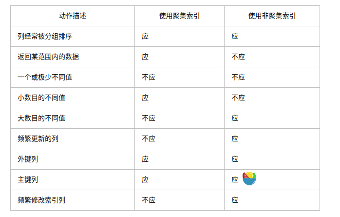
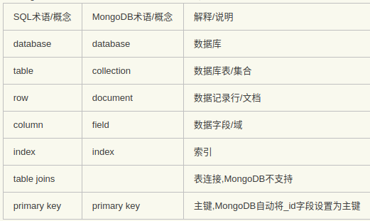

# MySql

  
**页是MySQL中磁盘和内存交互的基本单位，也是MySQL是管理存储空间的基本单位。**
   

- MyISAM引擎:使用B+Tree作为索引结构，叶节点的data域存放的是数据记录的地址;非聚集.
            MyISAM 适合于一些需要大量查询的应用，但其对于有大量写操作并不是很好。

- InnoDB索引:使用B+Tree作为索引结构;数据文件本身就是索引文件;辅助索引data域存储相应记录主键的值而不是地址;聚集    
            支持“行锁” ，于是在写操作比较多的时候，会更优秀。并且，他还支持更多的高级应用，比如：事务。 

1. InnoDB中页的大小一般为 16 KB，当记录中的数据太多，当前页放不下的时候，会把多余的数据存储到其他页中，这种现象称为行溢出。    
2. InnoDB有四种行格式，Compact、Redundant、Dynamic和Compressed

**区别**：
+ InnoDB支持事务，MyISAM不支持
+ InnoDB支持外键，而MyISAM不支持。对一个包含外键的InnoDB表转为MYISAM会失败  
>> innoDB是聚集索引，使用B+Tree作为索引结构，数据文件是和（主键）索引绑在一起的（表数据文件本身就是按B+Tree组织的一个索引结构），   
必须要有主键，通过主键索引效率很高。但是辅助索引需要两次查询，先查询到主键，然后再通过主键查询到数据。  
因此，主键不应该过大， 因为主键太大，其他索引也都会很大。

>>  MyISAM是非聚集索引，也是使用B+Tree作为索引结构，索引和数据文件是分离的，索引保存的是数据文件的指针。  
也就是说：InnoDB的B+树主键索引的叶子节点就是数据文件，辅助索引的叶子节点是主键的值；        
而MyISAM的B+树主键索引和辅助索引的叶子节点都是数据文件的地址指针。  

+ InnoDB支持表、行(默认)级锁，而MyISAM支持表级锁    
+ InnoDB表必须有主键（用户没有指定的话会自己找或生产一个主键），而Myisam可以没有    

## 事务：
**事务（Transaction）是由一系列对系统中数据进行访问与更新的操作所组成的一个程序执行逻辑单元。**

ACID
事务具有4个基本特征，分别是：    
    原子性（Atomicity）、一致性（Consistency）、隔离性（Isolation）、持久性（Duration），简称ACID。     

+ 原子性(Atomicity):事务中的所有操作作为一个整体像原子一样不可分割，要么全部成功,要么全部失败。   
    - 实现：
        - undo log(回滚日志)，当事务对数据库进行修改时，InnoDB会生成对应的undo log；
        - 如果事务执行失败或调用了rollback，导致事务需要回滚，便可以利用undo log中的信息将数据回滚到修改之前的样子。
+ 一致性(Consistency):事务的执行结果必须使数据库从一个一致性状态到另一个一致性状态。  
    - 一致性状态是指:    
        1. 系统的状态满足数据的完整性约束(主码,参照完整性,check约束等)            
        2. 系统的状态反应数据库本应描述的现实世界的真实状态,比如转账前后两个账户的金额总和应该保持不变。          
    - 实现：事务追求的最终目标，一致性的实现既需要数据库层面的保障，也需要应用层面的保障
+ 隔离性(Isolation):并发执行的事务不会相互影响,其对数据库的影响和它们串行执行时一样。   
                    比如多个用户同时往一个账户转账,最后账户的结果应该和他们按先后次序转账的结果一样。       
    - 实现：通过锁机制来保证
+ 持久性(Durability):事务一旦提交,其对数据库的更新就是持久的。任何事务或系统故障都不会导致数据丢失。
    - 实现     
	    - redo log(重做日志)， 当数据修改时会在redo log记录这次操作；
        - redo log采用的是WAL（Write-ahead logging，预写式日志），所有修改先写入日志，保证了数据不会因MySQL宕机而丢失。

**隔离级别**    
隔离性：在标准SQL规范中，定义了4个事务隔离级别，不同的隔离级别对事务的处理不同。
4个隔离级别分别是（从低到高）：     
- 读未提交（READ_UNCOMMITTED）:事务中的修改，即使没有提交，对其他事务也都是可见的,事务可以读取未提交的数据.(脏读）
- 读已提交（READ_COMMITTED）：一个事务从开始直到提交之前，所做的任何修改对其他事务都是不可见的。  
- 可重复读（REPEATABLE_READ） ：保证了在同一个事务中多次读取同样记录结果是一致的。    
- 串行化（SERIALIZABLE）：读取每一行数据都加锁。  

**事务并发引起的问题**  
数据库在不同的隔离性级别下并发访问可能会出现以下几种问题：  

+ 脏写：事务回滚其他事务对数据项的已提交修改    
+ 丢失更新：事务覆盖了其他事务对数据的已提交修改,导致这些修改好像丢失了一样。   
+ 脏读（Dirty Read）：一个事务读取了另一个事务未提交的数据  
+ 不可重复读（Unrepeatable Read）：一个事务对同一数据的读取结果前后不一致。 
+ 幻读（Phantom Read）：事务读取某个范围的数据时，因为其他事务的操作导致前后两次读取的结果不一致

ps：    
脏读和不可重复读的区别在于:     
>>前者读取的是事务未提交的脏数据,后者读取的是事务已经提交的数据,
只不过因为数据被其他事务修改过导致前后两次读取的结果不一样。    

幻读和不可重复读的区别在于：       
>>不可重复读是针对确定的某一行数据而言,而幻读是针对不确定的多行数据。     

事务的隔离级别越低,可能出现的并发异常越多,但是通常而言系统能提供的并发能力越强。    

## 锁相关
- 表锁：开销小，加锁快；不会出现死锁；锁定粒度大，发生锁冲突的概率最高，并发度最低；
    - 读锁：不会阻塞其他用户对同一表的读请求，但会阻塞对同一表的写请求
    - 写锁：会阻塞其他用户对同一表的读和写操作
- 行锁：开销大，加锁慢；会出现死锁；锁定粒度最小，发生锁冲突的概率最低，并发度也最高；
- 页级锁定：锁定颗粒度介于行级锁定与表级锁之间；会发生死锁。

- MyISAM 在执行查询语句（SELECT）前，会自动给涉及的所有表加读锁，
    在执行更新操作（UPDATE、DELETE、INSERT等）前，会自动给涉及的表加写锁  

------
- 悲观锁：在修改数据之前把数据锁住，然后再对数据进行读写，在它释放锁之前任何人都不能对其数据进行操作。
    - 特点：保证数据的独占性和正确性；加锁释放锁的过程会造成消耗，性能不高。
- 乐观锁：操作数据时不会对操作的数据进行加锁，只有到数据提交的时候才通过一种机制来验证数据是否存在冲突。
    - 特点：一种并发类型的锁，其本身不对数据进行加锁通而是通过业务实现锁的功能；性能高。  

## InnoDB默认什么级别？如何处理幻读？Next-key Lock
- MySQL 默认隔离级别是可重复读
- 可重复读情况下 加 Next-Key Lock 可避免幻读
- InnoDB中有三种行锁技术：
    - Record Lock：单个行记录上的锁，我们通常讲的行锁，它的实质是通过对索引的加锁实现； 
            只有通过索引条件检索数据，InnoDB才使用行级锁，否则，InnoDB将使用表锁。  
            在事务隔离级别为读已提交下，仅采用Record Lock 。    
    - Gap Lock：间隙锁，锁定一个范围，但不包含记录本身；
    - Next-Key Lock：Record Lock+Gap Lock，锁定一个范围，并且锁定记录本身
    - 当查询的索引含有唯一属性时，InnoDB会对Next-Key Lock进行优化，将其降级为Record Lock，即仅锁住索引本身，而不是范围  

## 索引

- 含义：索引是与表或视图关联的磁盘上结构，可以加快从表或视图中检索行的速度。索引包含由表或视图中的一列或多列生成的键。

索引类型：  
- FULLTEXT：全文索引，目前只有MyISAM引擎支持。只有 CHAR、VARCHAR ，TEXT 列上可以创建全文索引。
            它的出现是为了解决WHERE name LIKE “%word%"这类针对文本的模糊查询效率较低的问题。       
- HASH：HASH索引可以一次定位.只在“=”和“in”条件下高效，对于范围查询、排序及组合索引仍然效率不高。    
- BTREE: 将索引值按一定的算法，存入一个树形的数据结构中，
        每次查询都是从树的入口root开始，依次遍历node，获取leaf。
- RTREE: 相对于BTREE，RTREE的优势在于范围查找。

索引种类：
- 普通索引：仅加速查询（MySQL中基本索引类型，没有什么限制，允许在定义索引的列中插入重复值和空值，纯粹为了查询数据更快一点。）
- 唯一索引：加速查询 + 列值唯一（可以有null）
- 主键索引：加速查询 + 列值唯一（不可以有null）+ 表中只有一个。
- 组合索引：多列值组成一个索引，专门用于组合搜索，其效率大于索引合并(使用多个单列索引组合搜索)。 
    > 在表中的多个字段组合上创建的索引，只有在查询条件中使用了这些字段的左边字段时，
    索引才会被使用，使用组合索引时遵循最左前缀集合。例如，这里由id、name和age3个字段构成的索引，
    索引行中就按id/name/age的顺序存放，索引可以索引下面字段组合(id，name，age)、(id，name)或者(id)。
    如果要查询的字段不构成索引最左面的前缀，那么就不会是用索引，比如，age或者（name，age）组合就不会使用索引查询.
- 全文索引：只有在MyISAM引擎上才能使用，只能在CHAR,VARCHAR,TEXT类型字段上使用全文索引.

- 覆盖索引:select的数据列只用从索引中就能够取得，不必读取数据行，换句话说查询列要被所建的索引覆盖。
- 聚集（clustered）索引：指数据行的物理顺序与列值（一般是主键的那一列）的逻辑顺序相同，
                        一个表中只能拥有一个聚集索引。MySQL中一般默认主键为聚集索引。   
- 非聚集（unclustered）索引：该索引中索引的逻辑顺序与磁盘上行的物理存储顺序不同，一个表中可以拥有多个非聚集索引。

## 索引最左前缀（a， b， c）
    - 等值查找列(顺序无所谓)
        - where b = 3 and a = 1
    - 对多个列同时进行范围查找的话，只有对索引最左边的那个列进行范围查找的时候才能用到B+树索引
        - where a > 5 and b < 2
        - where b > 5 and a < 2
    - 精确匹配某一列并范围匹配另外一列
        - where a = 2 and b > 10
        - where a = 1 and b = 9 and c < 10

## 建立索引原则    
+ 定义主键的数据列一定要建立索引
+ 定义外键的列一定要建立索引
+ 对于经常查询的数据最好建立索引
+ 对于需要在指定范围内的快速或频繁查询的数据列
+ 经常用在where字句中的数据列
+ 经常出现在order by 、group by 后面的字段，建立索引。  
    如果建立的是复合索引，索引的字段顺序要和这些关键字后面的字段顺序一致，否则索引不会被使用。
+ 对于那些查询中很少涉及的列，重复值比较多的列不要建立索引  
+ 对于经常存取的列避免建立索引  
+ 对复合索引，按照字段在查询条件中出现的频度建立索引。      
   在复合索引中，记录首先按照第一个字段排序。对于在第一个字段上取值相同的记录，系统按照第二个字段的取值排序，   
   以此类推。因此只有复合索引的第一个字段出现在查询条件中，该索引才可能被使用，因此将应用频度高的字段，放置在   
   复合索引的前面，会使系统最大可能地使用索引，发挥索引的作用。 
    

# 索引失效的几种情况
- 在WHERE中使用OR时，有一个列没有索引，那么其它列的索引将不起作用,要想使用 or，又想让索引生效，只能将or条件中的每个列都加上索引
- 对于多列索引，不是使用的第一部分，则不会使用索引
- like查询以%开头
- 如果列类型是字符串，那一定要在条件中将数据使用引号引用起来,否则不使用索引
- where语句中使用了IS NULL或者IS NOT NULL

## 数据库最左前缀匹配原则： 
联合索引的规则：首先根据联合索引中最左边的、也就是第一个字段进行排序，
 在第一个字段排序的基础上，再对联合索引中后面的第二个字段进行排序，依此类推。

## 数据库的主键索引和普通索引的区别，哪个查询更快
- 主键索引
- 非主键索引的叶子节点存放的是主键的值，而主键索引的叶子节点存放的是整行数据    

## 数据库中文件在磁盘上的存储方式  
- heapfile

## 索引结构
B+ 树： B+树是为磁盘或其他直接存取辅助设备而设计的一种平衡查找树。

1.有k个子树的中间节点包含有k个元素（B树中是k-1个元素），每个元素不保存数据，只用来索引，所有数据    
都保存在叶子节点。  

2.所有的叶子结点中包含了全部元素的信息，及指向含这些元素记录的指针，且叶子结点本身依关键字的大小      
自小而大顺序链接。  

3.所有的中间节点元素都同时存在于子节点，在子节点元素中是最大（或最小）元素。

## 为什么说B+-tree比B 树更适合实际应用中操作系统的文件索引和数据库索引(不用b树)： 
- B+-tree的磁盘读写代价更低
> B+-tree的内部结点并没有指向关键字具体信息的指针。因此其内部结点相对B 树更小。如果把所有同一内部结点的关键字存放在同一盘块中，那么盘块所能容纳的关键字数量也越多。一次性读入内存中的需要查找的关键字也就越多。相对来说IO读写次数也就降低了。
    举个例子，假设磁盘中的一个盘块容纳16bytes，而一个关键字2bytes，一个关键字具体信息指针2bytes。一棵9阶B-tree(一个结点最多8个关键字)的内部结点需要2个盘快。而B+ 树内部结点只需要1个盘快。当需要把内部结点读入内存中的时候，B 树就比B+ 树多一次盘块查找时间(在磁盘中就是盘片旋转的时间)。

- B+-tree的查询效率更加稳定
> 由于非终结点并不是最终指向文件内容的结点，而只是叶子结点中关键字的索引。所以任何关键字的查找必须走一条从根结点到叶子结点的路。所有关键字查询的路径长度相同，导致每一个数据的查询效率相当。

- B树必须用中序遍历的方法按序扫库，而B+树直接从叶子结点挨个扫一遍就完了，B+树支持range-query非常方便，而B树不支持。 

## B+ 树缺点: 会产生大量的随机IO
- 主键不是有序递增的，导致每次插入数据产生大量的数据迁移和空间碎片；
- 即使主键是有序递增的，大量写请求的分布仍是随机的；

##　不用红黑树: 
- 在大规模数据存储的时候，红黑树往往出现由于树的深度过大而造成磁盘IO读写过于频繁，进而导致效率低下.
- B+ 可将一个节点的大小设为等于一个页，保证一个节点物理上也存储在一个页里, 这样每个节点只需要一次I/O就可以完全载入。 

##　不用 hash:
- 利用Hash需要把数据全部加载到内存中，如果数据量大，消耗内存.
- HASH索引不支持部分索引列查找，不支持范围查找。
- HASH冲突,　出现冲突时要逐行比较。当HASH冲突特别多的时候，维护操作的成本就会变大。
    比如一次数据的删除，引擎需要遍历对应HASH值链表上的每一行，找到并删除对应的引用。    
ps :磁盘ＩＯ：　移动动臂（找到盘面），盘面旋转

## InnoDB引擎主键为什么设成自增  
- innodb 必须要有主键
- 使用自增主键，那么每次插入新的记录，记录就会顺序添加到当前索引节点的后续位置，当一页写满，就会自动开辟一个新的页。
    不需要移动已有数据，效率高。    
- 使用非自增主键，由于每次插入主键的值近似于随机，因此每次新纪录都要被插到现有索引页的中间某个位置，需要移动数据。
    频繁的移动、分页操作造成大量的碎片，得到不够紧凑的索引结构，后续不得不通过OPTIMIZE TABLE来重建表并优化填充页面。 

## 分区、分表、分库
- 分区：把一张表的数据分成N个区块，在逻辑上看最终只是一张表，但底层是由N个物理区块组成的
    - 水平分区：对表的行进行分区
    - 垂直分区：通过对表的垂直划分来减少目标表的宽度
    - 分区解决的问题：提升查询效率
- 分表：把一张表按一定的规则分解成N个具有独立存储空间的实体表。
- 分库

- 分区和分表的区别与联系
    - 分区和分表的目的都是减少数据库的负担，提高表的增删改查效率。
    - 分区只是一张表中的数据的存储位置发生改变，分表是将一张表分成多张表。
    - 当访问量大，且表数据比较大时，两种方式可以互相配合使用。
    - 当访问量不大，但表数据比较多时，可以只进行分区。
- 常见分区分表的规则策略
    - Range（范围）
    - Hash（哈希）：将数据按照某列进行hash计算后更加均匀的分散到各个分区
    - 按照时间拆分

# redis

## redis 过期时间设置
- EXPIRE 单位 秒   
    - expire col_name 30 
- PEXPIRE 单位 毫秒 

## redis 有哪些数据结构
String、List、Set、Hash、ZSet   

## redis 为什么快
- 完全基于内存
- 数据结构简单，对数据操作也简单（String、List、Set、Hash、ZSet）
- 采用单线程，避免了不必要的上下文切换和竞争条件
- 使用多路I/O复用模型，非阻塞IO

## redis 的有序列表怎么实现
- ziplist（压缩列表）：将数据按照一定规则编码在一块连续的内存区域，目的是节省内存。
    - 保存的元素少于128个
    - 保存的所有元素大小都小于64字节
- skiplist（跳表）：在每个节点中维持多个指向其他节点的指针
    - 支持平均O(logN)、最坏O(N)复杂度的节点查找

## 跳表有什么优势，比如和二叉树比较
- 每一个节点的层数（level）是随机出来的，而且新插入一个节点不会影响其它节点的层数。
- 插入操作只需要修改插入节点前后的指针，而不需要对很多节点都进行调整
- 并发环境下锁的东西比较少
      

## 使用Redis时，对热点key怎么解决？
- 热点 key：访问频率高的key
    - 后果：
        - 流量集中，达到物理网卡上限。
        - 请求过多，缓存分片服务被打垮。
        - DB击穿，引起业务雪崩。
    - 解决：
        - 利用二级缓存
        - 备份热key

## 使用Redis时，遇到一个很大的Value怎么办
虚拟内存    

## Redis 持久化
- RDB持久化 
    - 指定的时间间隔内将内存中的数据集快照写入磁盘，实际操作过程是fork一个子进程，  
        先将数据集写入临时文件，写入成功后，再替换之前的文件，用二进制压缩存储。   
    - 优点：
        - 一旦采用该方式，整个Redis数据库将只包含一个文件，这对于文件备份而言是非常完美的 
        - 灾难恢复而言，RDB是非常不错的选择，可以非常轻松的将一个单独的文件压缩后再转移到其它存储介质上。
        - 性能最大化。对于Redis的服务进程而言，在开始持久化时，它唯一需要做的   
            只是fork出子进程，之后再由子进程完成这些持久化的工作，这样就可以极大的避免服务进程执行IO操作。 
        - 相比于AOF机制，如果数据集很大，RDB的启动效率会更高。
    - 缺点：
        - 出现宕机现象，此前没有来得及写入磁盘的数据都将丢失。
        - 由于RDB是通过fork子进程来协助完成数据持久化工作的，因此，
            如果当数据集较大时，可能会导致整个服务器停止服务几百毫秒，甚至是1秒钟。       
- AOF（append only file）持久化
    - 以日志的形式记录服务器所处理的每一个写、删除操作，查询操作不会记录，以文本的方式记录，可以打开文件看到详细的操作记录。
    - 优点
        - 可以带来更高的数据安全性，即数据持久性。3中同步策略，即每秒同步、每修改同步和不同步。
        -  由于该机制对日志文件的写入操作采用的是append模式，因此在写入过程中即使出现宕机现象，
            也不会破坏日志文件中已经存在的内容  
    - 缺点
        - 对于相同数量的数据集而言，AOF文件通常要大于RDB文件。RDB 在恢复大数据集时的速度比 AOF 的恢复速度要快。
        - 根据同步策略的不同，AOF在运行效率上往往会慢于RDB

## mongo    
        

## 数据类型
- String、Integer、Boolean、Double、Array、Timestamp、Object、Object ID、Null、Date、Binary Data	

## MySQL和mongodb的区别
- MYSQL 是关系型数据库
- MYSQL 查询语句使用传统的sql语句
- MongoDB 是非关系型数据库，属于文档型数据库。
- MongoDB 以 key：value 形式存储
数据
- MongoDB 将热数据存储在物理内存中，使得热数据的读写变得十分快。 
- MongoDB 提供可扩展的高性能数据存储.
- MongoDB 占用的空间很大，以空间换时间。  

## redis和mongodb的区别
- MongoDB 支持字段索引、游标操作，其优势在于查询功能比较强大，擅长查询 JSON 数据，能存储海量数据，不支持事务。
- Redis 是一个开源（BSD许可）的，内存中的数据结构存储系统，它可以用作数据库、缓存和消息中间件
- Redis 数据全部存在内存，定期写入磁盘，当内存不够时，可以选择指定的 LRU 算法删除数据
- MongoDB 数据存在内存，由 linux系统 mmap 实现，当内存不够时，只将热点数据放入内存，其他数据存在磁盘
- Redis 事务支持比较弱，只能保证事务中的每个操作连续执行
- mongodb的所有数据实际上是存放在硬盘的，所有要操作的数据通过mmap的方式映射到内存某个区域内。

## 关系型数据库、非关系型数据库
- 关系型数据库：指采用了关系模型来组织数据的数据库。    
    - 关系模型指的就是二维表格模型，而一个关系型数据库就是由二维表及其之间的联系所组成的一个数据组织。
    - 常用的概念：
        - 关系：一张二维表，每个关系都具有一个关系名，也就是表名
        - 元组：二维表中的一行，在数据库中被称为记录
        - 属性：二维表中的一列，在数据库中被称为字段
        - 域：属性的取值范围，也就是数据库中某一列的取值限制
        - 关键字：一组可以唯一标识元组的属性，数据库中常称为主键，由一个或多个列组成
    - 优点：
        - 容易理解：二维表结构是非常贴近逻辑世界的一个概念
        - 使用方便：通用的SQL语言使得操作关系型数据库非常方便
        - 易于维护：丰富的完整性(实体完整性、参照完整性和用户定义的完整性)大大减低了数据冗余和数据不一致的概率  
    - 缺点：在一张包含海量数据的表中查询，效率是非常低

- 非关系型数据库：指非关系型的，分布式的，且一般不保证遵循ACID原则的数据存储系统
    >非关系型数据库以键值对存储，且结构不固定，每一个元组可以有不一样的字段，
    每个元组可以根据需要增加一些自己的键值对，不局限于固定的结构，可以减少一些时间和空间的开销  
    - 优点：用户可以根据需要去添加自己需要的字段
        >系统的升级，功能的增加，往往意味着数据结构巨大变动，这一点关系型数据库难以应付，
        需要新的结构化数据存储。由于不可能用一种数据结构化存储应付所有的新的需求，因此，
        非关系型数据库严格上不是一种数据库，应该是一种数据结构化存储方法的集合。
    - 缺点：
        - 只适合存储一些较为简单的数据，
        - 不适合持久存储海量数据

## 数据库如何在读时确保数据时最新的
- 半同步复制
- 全同步复制
- 数据库中间件

