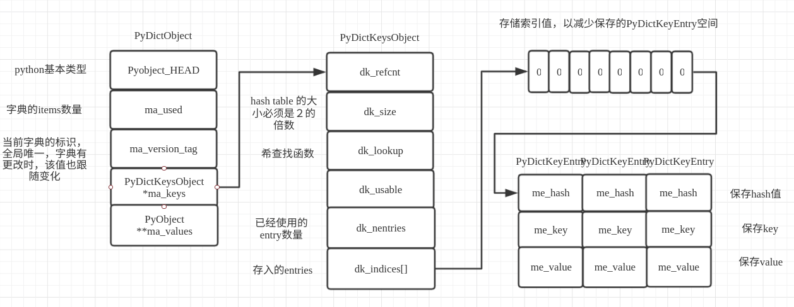

# Python dict 源码简析

## **dict对象**
```C    
typedef struct{ 
        PyObject_HEAD   
        Py_ssize_t ma_used;   //key个数 
        uint64_t ma_version_tag; //字典标识     
        PyDictkeysObject *ma_keys; //key值      
        PyObject **ma_values;  //values 
}PyDictObject;  
```
```C
struct _dictkeysobject{ 
        Py_ssize_t dk_refent;   //引用计数      
        Py_ssize_t dk_size;     //hash table的大小必须是二的倍数        
        dk_lookup_func dk_lookup; //哈希查找函数        
        Py_ssize_t dk_usable;   //可用的entry数量       
        Py_ssize_t dk_nentries; //已经使用的entry数量   
        char dk_indices[];      //存入的entries 
}
typedef struct _dictkeysobject PyDictKeysObject;
```

## **在 python 的字典中，一个键值对以 PyDictKeyEntry 类型来保存**
```C
typedef struct{ 
        Py_hash_t me_hash;    //哈希值  
        PyObject *me_key;       //对应的key值   
        PyObject *me_value;     //key对应的value值      
}PyDictKeyEntry;        
```


## **Entry 有3种状态**
- ### *unused： key==null && value==null*
- ### *active： key！=null && value!=null*
- ### *dummy:  key==dummy && value==null*     

### **状态转移：unused --> active <--> dummy**


>### **dict** 在内部通过hash表实现，通过映射函数把key映射成一个整数，再把整数作为索引去访问内存区域。 采用开放地址法解决冲突，通过一个二次探测函数f去计算下一个可用的位置.这个过程会到达多个位置，这些位置形成了一个“冲突探测链”。冲突探测链在查找某个元素起到重要作用，因此在删除某个位置的元素时，不能直接把这个位置的内容删除。如果删除的话后续依赖于这个位置的其它值就不能被找到，所以只能进行伪删除。所谓伪删除就是把元素设置为dummy态，表示没有用到的值但还会用到的废弃态。

## dict 的插入：           
1. ### 计算key的哈希值      
2. ### 根据哈希值判断内存区域是否为空           
   - 为空：插入元素             
   - 不为空，判断key是否相等。如果相等，说明元素已经存在，如果value不同，则更新value，不相等，说明发生了hash冲突，二次探测        

## dict的查找    
计算key的哈希值-> 比较key和hash 


```C 
// value_addr是指向匹配entry中值的指针。 正确的情况下返回一个指向entry的指针，出错则会返回NULL
lookdict(PyDictObject *mp, PyObject *key,
         Py_hash_t hash, PyObject **value_addr)
{
    size_t i, mask, perturb;
    PyDictKeysObject *dk;
    PyDictKeyEntry *ep0;

top:
    dk = mp->ma_keys;
    ep0 = DK_ENTRIES(dk);
    mask = DK_MASK(dk);  // DK_MASK(dk) (((dpck)->dk_size)-1)， 字典容量减一
    perturb = hash;
    i = (size_t)hash & mask; // 散列表下标

    for (;;) {
        //  ix = indices[i], 索引与entry分开存储，节省空间
        Py_ssize_t ix = dictkeys_get_index(dk, i);

        //  Unused.  index == DKIX_EMPTY, 没有找到key
        if (ix == DKIX_EMPTY) {
            *value_addr = NULL;
            return ix;
        }
        if (ix >= 0) {
            PyDictKeyEntry *ep = &ep0[ix];
            assert(ep->me_key != NULL);

            // 查找成功
            if (ep->me_key == key) {
                *value_addr = ep->me_value;
                return ix;
            }
            // 哈希冲突
            if (ep->me_hash == hash) {
                PyObject *startkey = ep->me_key;
                Py_INCREF(startkey);
                //-1 for error, 0 for false, 1 for true
                int cmp = PyObject_RichCompareBool(startkey, key, Py_EQ);
                Py_DECREF(startkey);
                if (cmp < 0) {
                    *value_addr = NULL;
                    return DKIX_ERROR;
                }
                if (dk == mp->ma_keys && ep->me_key == startkey) {
                    // 比较成功
                    if (cmp > 0) {
                        *value_addr = ep->me_value;
                        return ix;
                    }
                }
                else {
                    /* The dict was mutated, restart */
                    比较失败，继续查找
                    goto top;
                }
            }
        }
        perturb >>= PERTURB_SHIFT;
        i = (i*5 + perturb + 1) & mask;
    }
    Py_UNREACHABLE();
}


```
**ps： 不在1/2--2/3时扩容,扩容后会重新hash，即元素位置重新排放**